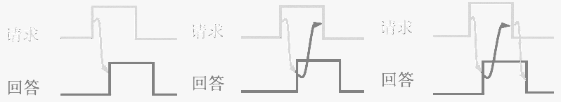

### 总线概念及分类

**总线特性**：机械特性、电气特性、功能特性、时间特性

#### 总线分类

- 按传输方式：串行、并行
- 按总线功能：片内、系统（数据、地址、控制）、通信
- 按时序：同步、异步

#### 系统总线结构

单总线结构、双总线结构、三总线结构、四总线结构。

### 总线性能指标

**总线传输周期**：一次总线操作所需的时间，包括**申请**、**寻址**、**传输**、**结束**等阶段。

**总线时钟周期**：机器的时钟周期。

**总线工作频率**：总线传输周期的倒数。

**总线时钟频率**：总线时钟周期的倒数。

**总线宽度**：同时能传输的数据位数，通常指数据总线的根数。

**总线带宽**：数据传输率，单位时间总线上可传输数据的位数。

**总线复用**：一种信号线在不同时间传输不同的信息。

**信号线数**：地址总线、数据总线、控制总线等3种总线的总和。

### 总线仲裁

**主设备**：获得总线控制权的设备。

**从设备**：被主设备访问的设备。

|              | 链式查询                                      | 计数器定时查询                                               | 独立请求                                      |
| -----------: | :-------------------------------------------- | :----------------------------------------------------------- | :-------------------------------------------- |
| **控制线数** | 总线请求：$1$ 总线允许：$1$ 总先忙：$1$ | 总线请求：$1$ 总线允许：$\lceil{log_2{n}}\rceil$ 总先忙：$1$ | 总线请求：$n$ 总线允许：$n$ 总先忙：$1$ |
|     **优点** | 优先级固定、结构简单、容易扩充                | 优先级灵活                                                   | 响应速度快、优先级灵活                        |
|     **缺点** | 对电路故障敏感、优先级不灵活                  | 控制线多、控制相对复杂                                       | 控制线多、控制复杂                            |

### 总线操作

#### 同步定时

在一个总线周期中，发送方和接收方可进行一次数据传送。

**优点**：传输速度快。

**缺点**：主从设备强制性同步。

#### 异步定时

- **不互锁**：主设备请求后不等待从设备**回答信号**，一段时间后便自动撤销**请求信号**。
- **半互锁**：主设备请求后等待从设备**回答信号**；从设备不等待获知主设备**请求信号**已撤销，一段时间后便自动撤销**回答信号**。
- **全互锁**：主设备请求后等待从设备**回答信号**；从设备回答后，等待主设备**请求信号**撤销再撤销**回答信号**。

**优点**：总线周期长度可变。

**缺点**：控制方式复杂，速度较慢。

#### 半同步通信

统一时钟的基础上，增加等待响应信号。

#### 分离式通信

总线传输周期分为主模块占用和从模块占用。

### 总线标准

ISA
EISA
PCI
AGP
VESA
PCI-E
USB
IDE
SATA
SCSI
