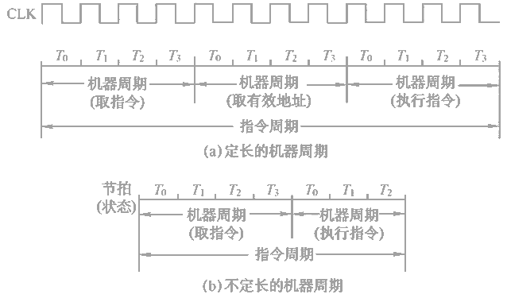
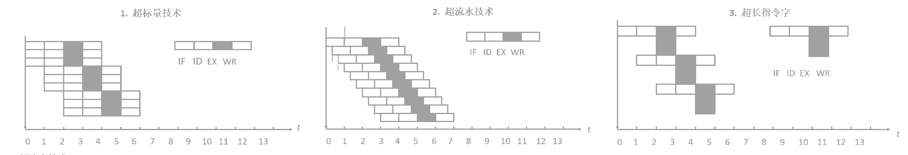

### CPU的功能

**功能**：指令控制、操作控制、时间控制、数据加工、中断处理。

**运算器**：算数运算、逻辑运算。

**控制器**：取指令、分析指令、执行指令、中断处理。

**主要寄存器**：通用寄存器、专用寄存器（指令寄存器IR、程序计数器PC、存储器数据寄存器MDR、存储器地址寄存器MAR、程序状态字寄存器PSWR）

### 指令周期

**指令周期**：CPU从主存中每取出并执行一条指令所需的全部时间。

**机器周期/CPU周期**：指令周期常用若干机器周期来表示。

**时钟周期/节拍$T$**：一个机器周期包含若干时钟周期，是CPU操作的最基本单位。

- **指令周期数据流**：取指周期、间址周期、执行周期、中断周期。
- **指令执行方案**：单指令周期、多指令周期、**流水线方案**。

### 指令流水线

**装入时间**：第一个任务（例如$I_1$）从开始到结束的时间。

**排空时间**：最后一个任务（例如$I_5$）从开始到结束的时间。

#### 性能指标

**吞吐量（TP）**：单位时间内流水线所完成的任务数量，或是输出结果的数量。

$$TP = \dfrac{n}{(k+n-1)Δt}$$

- $k$：一条指令执行分为$k$个阶段。
- $n$：任务数量。
- $Δt$：一个时钟周期。

**加速比**：不使用流水线所用的时间与使用流水线所用的时间之比。

$$S = \dfrac{knΔt}{k+n-1)Δt} = \dfrac{kn}{k+n-1}$$

**效率**：$n$个任务占用的时空区的有效面积。

#### 影响流水线的因素

|              情况 | 说明                                   | 解决方案                                                     |
| ----------------: | :------------------------------------- | :----------------------------------------------------------- |
| **结构/资源冲突** | 多指令在同一时刻争用同一资源           | 后一指令暂停一周期 资源重复配置                           |
| **数据/数据冲突** | **后**一条指令依赖前一条指令的执行结果 | 硬件阻塞(stall)、软件插入NOP 数据旁路技术                |
| **控制/控制冲突** | 转移等指令造成断流                     | 尽早判别 预取双向目标指令 加快或提前形成条件码 提高分支预测成功率 |

#### 流水线分类

- 根据使用级别：部件功能级、处理机级、处理机间
- 根据完成功能：单功能、多功能
- 根据同一时间各段连接方式：静态、动态
- 各功能段是否有反馈信号：线性、非线性

#### 多发技术

- 超标量技术：每个时钟周期内并发多条指令，不能调整指令的执行顺序。
- 超流水技术：一个时钟周期内再分段，不能调整指令的执行顺序。
- 超长指令字

### 控制方式

- 同步控制方式
- 异步控制方式
- 联合控制方式
- 人工控制方式

### 微程序设计

**微指令编码**：直接编码、字段编码（字段直接、字段间接）、最短编译法

**微指令格式**：水平型、垂直型

**微地址的形成**：增量方式、断定方式
