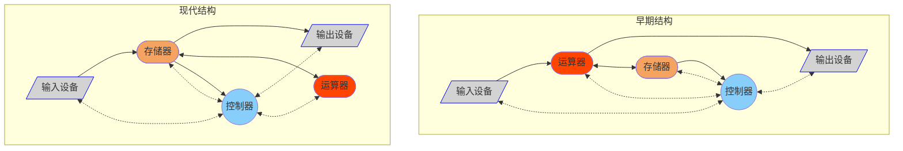
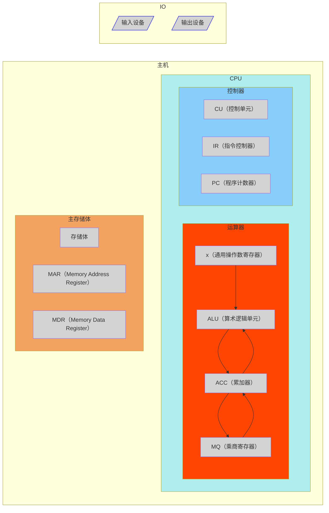

### 发展史

- 电子管
- 晶体管
- 中小规模集成电路
- 大规模集成电路

### 性能指标

**字长**：一次能处理的二进制数据的位数

**时钟频率**：$\textnormal{\footnotesize CPU主频} = \dfrac{1}{\textnormal{\footnotesize CPU时钟周期}}$

**运算速度**：

- **CPI（Clock cycle Per Instruction）**：执行一条指令所需要的时钟周期数。
- **IPS（Instruction Per Second）**：每秒执行多少条指令，$IPS = \dfrac{\textnormal{\footnotesize 主频}}{\textnormal{\footnotesize 平均CPI}}$
- **FLOPS**：每秒执行多少次浮点运算。

**内存容量**：主存大小。

### 冯诺依曼结构

- **五大部分**组成；
- 指令和数据以同等地位存储；
- 指令和数据用**二进制**表示；
- 指令由操作码和地址码组成；
- **存储程序**；
- 以运算器为中心（早期）。

### 计算机构成

**硬件系统**：主机（CPU、控制器、主存）、外部设备或IO设备（硬盘、键盘、显示器等）

**软件系统**：系统软件、应用软件

**计算机层次结构**：

- M4：高级语言
- M3：汇编语言
- M2：操作系统机器（向上提供广义指令）
- M1：传统机器（执行机器语言指令）
- M0：微程序机器（执行微指令）
