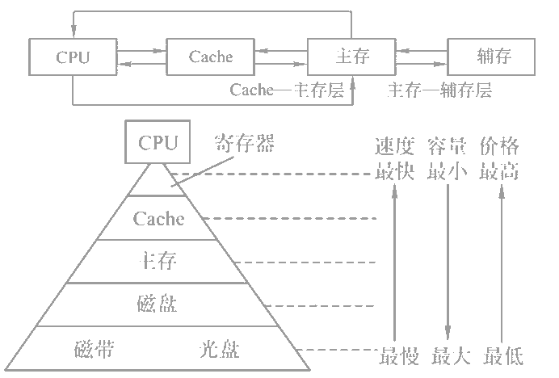
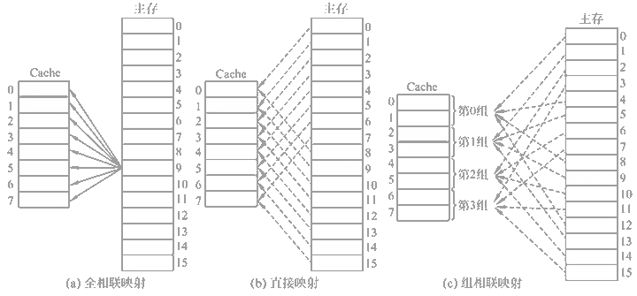

### 存储器分类

- 随机存取
  - RAM：随机存储器，断电后信息丢失。
    - SRAM：一般用作Cache。
    - DRAM
  - ROM：只读存储器。
    - MROM：掩膜式ROM
    - PROM：一次可编程ROM
    - EPROM：可擦除可编程ROM
    - Flash Memory：闪存
    - 固态硬盘
- 顺序存取
  - 外存/辅存：如磁盘、磁带、光盘等。

|                |  SRAM  |  DRAM  |
| -------------: | :----: | :----: |
|   物理存储单元 | 触发器 |  电容  |
| 是否破坏性读出 |   否   |   是   |
|   是否需要刷新 |   否   |   是   |
|   行列地址传送 |  同时  | 分两次 |
|       运行速度 |   快   |   慢   |
|         集成度 |   低   |   高   |
|         发热量 |   大   |   小   |
|       存储成本 |   高   |   低   |

#### DRAM刷新策略

- 集中刷新
- 分散刷新
- 异步刷新

### 存储器性能

$$\textnormal{\footnotesize 存取周期} = \textnormal{\footnotesize 存取时间} + \textnormal{\footnotesize 恢复周期}$$

### 主存扩展

#### 位扩展

待补充

#### 字扩展

待补充

### Cache策略

#### 地址映射

- 全相联
- 直接相联
- 组相联
- 标记项

#### 替换算法

- 随机算法
- 先进先出
- 近期最少使用（LRU）
- 最不经常使用（LFU）

#### 写策略

- CPU与L1缓存：全写法+非写分配法
- L2缓存与L2缓存、L2缓存与主存：写回法+写分配法

### 虚拟存储器

从逻辑上为用户提供一个比物理贮存容量大得多，可寻址的“主存储器”。

- 页式：主存的页称为实页，虚存的页称为虚页。
- 段式：虚存地址分为段号和段内地址。
- 段页式：虚存地址含有段号、段内页号和页内地址。

#### 快表

放在主存中的页表称为**慢表**，放在Cache中的页表称为**快表（TLB）**。
