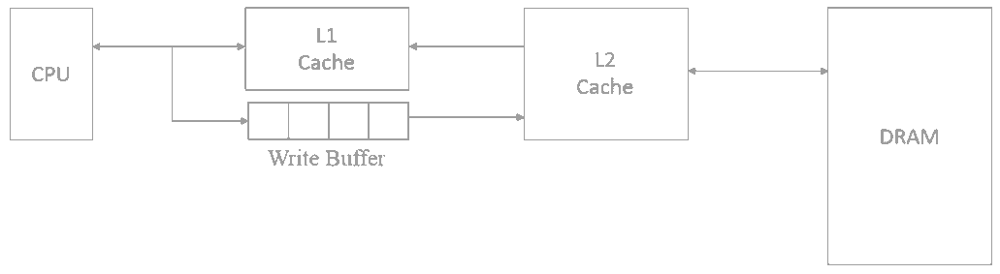

### 存储器分类

**按介质分类**：半导体器件、磁性材料、光盘等

**按存取方式**：随机存储器、顺序存储器、半顺序存储器等

**按作用分类**：缓存、主存、闪存、辅存等

**按读写功能**：ROM、RAM等

- RAM：随机存储器，断电后信息丢失。
  - SRAM：一般用作Cache。
  - DRAM：有集中刷新、分散刷新、异步刷新三种。
- ROM：只读存储器。
  - MROM：掩膜式ROM
  - PROM：一次可编程ROM
  - EPROM：可擦除可编程ROM
  - Flash Memory：闪存
  - 固态硬盘

|                |  SRAM  |  DRAM  |
| -------------: | :----: | :----: |
|   物理存储单元 | 触发器 |  电容  |
| 是否破坏性读出 |   否   |   是   |
|   是否需要刷新 |   否   |   是   |
|   行列地址传送 |  同时  | 分两次 |
|       运行速度 |   快   |   慢   |
|         集成度 |   低   |   高   |
|         发热量 |   大   |   小   |
|       存储成本 |   高   |   低   |

### 存储器层次结构

**性能指标**：

- 速度，$\textnormal{\footnotesize 存取周期} = \textnormal{\footnotesize 存取时间} + \textnormal{\footnotesize 恢复周期}$
- 容量
- 单位价格

**存储芯片基本结构**：

- 地址总线（$A$）：地址线数量应能覆盖所有存储单元。
- 数据总线（$D$）：数据线数量应为位长。
- 控制总线
  - 读控制线
  - 写控制线
  - 片选线

*例*：对于单个`512K×8bit`的芯片，有$num(A) ≥ 2^{9+10}$，$num(D) = 8$。

### 主存扩展

|              | 扩展                   | 地址总线                       | 数据总线                         |
| -----------: | :--------------------- | :----------------------------- | :------------------------------- |
|   **位扩展** | 存储字长↑              | 每个芯片与**全部**地址总线相连 | 每个芯片仅与**部分**数据总线相连 |
|   **字扩展** | 存储字容量↑            | 需要片选                       | 每个芯片与**全部**数据总线相连   |
| **同时扩展** | 存储字长↑、存储字容量↑ |                                |                                  |

### Cache策略

**地址映射**：

|                | 说明                            | 优点     | 缺点           |
| -------------: | :------------------------------ | :------- | :------------- |
| **全相联映射** | 字块可映射到Cache任何位置上 | 命中率高 | 所需逻辑电路多 |
|   **直接映射** | 主存块仅能与Cache固定位置对应 | 实现简单 | 缓存利用率低   |
| **组相联映射** | 组采用**直接映射**，组内**全相联映射** |          |                |

**写策略**：

- CPU与L1缓存：全写法+非写分配法
- L1缓存与L2缓存、L2缓存与主存：写回法+写分配法

**替换算法**：

- 随机算法
- 先进先出
- 近期最少使用（LRU）
- 最不经常使用（LFU）
