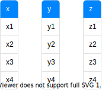

# [数据库系统概论](../index.html)

[TOC]

## 基本概念

### DB、DBS、DBMS

**数据库（DB）**：长期存储在计算机内的、有组织、可共享的数据集合。

**数据库管理系统（DBMS）**：数据定义、数据操纵、完整性约束、数据组织与管理、数据库恢复、数据通信接口。

**数据库系统（DBS）**：数据结构化、数据共享度高、数据扩充较方便、数据独立性高、数据由DBMS进行统一管理和控制。

### 三级模式

|            |       别名       | 描述                                                         | 基本单位/内容 |
| ---------: | :--------------: | :----------------------------------------------------------- | :-----------: |
| **外模式** | 子模式、用户模式 | 一个模式中可以有多个外模式                                   |     视图      |
|   **模式** |     逻辑模式     | 数据库中全体数据的逻辑结构和特征的描述 一个数据库只有一个模式 |    基本表     |
| **内模式** |     存储模式     | 数据库中全部数据的物理结构，数据存储方法等 一个数据库只有一个内模式 |   存储文件    |

|            映象 | 说明                           | 数据与应用独立性 |
| --------------: | :----------------------------- | ---------------- |
| **外模式/模式** | 模式改变，调整映像，外模式不变 | 逻辑上独立       |
| **模式/内模式** | 存储改变，调整映像，模式不变   | 物理上独立       |

### 数据模型

#### 概念模型

**关系**：一个关系就对应一个基本表。

**实体**：客观存在并可相互区别的事物，对应表中的一个元组（即一行数据）。

**属性**：实体所具有的某一特性，对应表中的一个字段（即一列）。

**域**：属性的取值范围。

#### 关系模型

**码（*key*）**：唯一标识实体的属性集，包含所有的属性。

**超码（*super key*）**：若关系中的，某一属性（或多个属性组成的组）能唯一的标识关系中的每一个实体，则该属性（或属性组）就是超码。

**候选码（*candidate key*）**：超码的一个子集，候选码的任意一个子集都不再是超码，即**候选码是最小的超码**。一个关系中可能存在多个候选码。

**主属性**：所有候选码中都包含的属性称为主属性。

**非主属性**：除了主属性之外的存在于关系之中的其它属性。

**主码（*primary key*）**：从候选码中选出的作为唯一标识关系中实体的码。

**外码（*foreign key*）**：若一个关系中的某一属性是另一个关系中的主码，则这个属性为外码。外码的值等于空或其对应的主码中的一个值。

#### 关系模式

E-R图转为关系模式。

### 设计步骤

**逻辑结构设计**：把概念阶段设计的E-R图转换为与选用DBMS产品所支持的数据模型相符合的逻辑结构。

**物理结构设计**：为给定的逻辑模型选取一个最适合应用要求的物理结构的过程。

## 关系代数运算

**基础运算**：并、交、差、笛卡尔积

**专门运算符**：选择、投影、连接（非等值连接、等值连接、自然连接、外连接、左外连接、右外连接）、除法

### 关系代数等价规则

- 连接、笛卡尔积交换律
- 连接、笛卡尔积结合律
- 投影串接定律
- 选择串接定律
- 选择、投影的交换律
- 选择、笛卡尔积的交换律
- 选择、并操作分配律
- 选择、差运算分配律
- 选择、自然连接分配律
- 投影、笛卡尔积分配律
- 投影、并操作分配律

### 查询优化策略

1. 选择运算尽可能先做。
1. 把投影运算和选择运算同时进行。
1. 把投影同其前或后的双目运算结合起来。
1. 把某些选择同在它前面要执行的笛卡尔积结合起来成为一个连接运算。
1. 找出公共子表达式。

## 安全性与完整性

### 安全标准

| EAL  | TCSEC | Defination |
| :--: | :---: | :--------- |
| EAL1 |       | 功能测试 |
| EAL2 | C1    | 结构测试 |
| EAL3 | C2    | 系统地检查和测试 |
| EAL4 | B1    | 系统地设计、测试和复查 |
| EAL5 | B2    | 半形式化设计和测试 |
| EAL6 | B3    | 半形式化验证的设计和测试 |
| EAL7 | A1    | 形式化验证的设计和测试 |

### 数据库安全控制方法

- 用户身份鉴别
- 存取控制
  - 自主存取控制
    - 定义用户权限： 数据库对象、操作类型
    - 合法权限检查
  - 强制存取控制
    - 用户密级大于等于数据密级时，用户才能读取此数据；
    - 用户密级小于等于数据密级时，用户才能写入此数据。
- 安全审计
- 加密

### 关系的完整性

- **实体完整性**：主码不能取空值（*null value*），空值即“不知道”、“不存在”或“无意义”的值。
- **参照完整性**：外码的值等于空或其对应的主码中的一个值。
- **用户定义的完整性**
- 触发器

## 索引

### 索引分类

- 物理存储
  - 聚簇索引：叶节点就是数据
  - 辅助索引（二级索引）：叶节点仍是索引
- 数据结构：B+Tree、R-Tree、Hash
- 引列数量：单列索引、多列索引
- 索引字段：
  - 主键索引（Primary Key）、普通索引（Key）、唯一索引（Unique）
  - 联合索引、全文索引

### 多列索引与最左匹配

当遇到范围查询（`<`、`>`、`between`、`like`）时就会停止匹配。

对$(a,b)$字段建立一个索引。

- $a = 1$
- $a = 1 {\ and\ } b = 2$
- $b = 2 {\ and\ } a = 1$（自动优化）
- $b = 2$

对$(a,b,c,d)$字段建立一个索引。

- $a = 1 {\ and\ } b = 2 {\ and\ } c > 3$${\ and\ } d = 4 $

建立索引时应注意

- 将经常判`=`的字段放在前面。
- 将区分度高的字段放在前面。
- 在有`WHERE`字句的`ORDER BY`中，如果两者不使用相同的索引，则排序操作无法利用索引完成。

### $B-tree$和$B+tree$的主要区别

| 区别 | $B-tree$ | $B+tree$ |
| -: | :- | :- |
| **非叶节点** | 保存索引和数据（树会较高） | 只存索引 |
| **相邻叶节点** | 无特殊结构 | 通过链表指针连起来 |
| **记录** | 只出现在一个结点中 | 可以出现多次 |

### 为什么索引结构使用$B+tree$

| 替代选项 | 缺点 |
| -: | :- |
| **二叉树** | 最坏情况下会退化到${\small O(n)}$的复杂度（变成链表） |
| **红黑树** | 树高维持在${\small O(log_2(n))}$，读取磁盘的次数过多 |
|          **Hash** | 时间复杂度为$O(1)$，但丧失了数据间的关联性 |
| **${\small B-Tree}$** | 相同的数据量，B+树查询磁盘的次数更少 |

## 规范化

### 数据依赖

一个关系内部属性与属性之间的一种约束关系。这种约束关系通过属性间的相等与否体现出来的数据间相关联系。它是现实世界属性之间相互联系的抽象，是数据内在的性质，语义的体现。数据依赖包括**函数依赖**和**多值依赖**。

### 函数依赖

对于关系模式属性集的两个子集$X$和$Y$，在任意一个可能的关系上，不存在$X$属性值相同而$Y$属性值不同，则称$X$函数确定$Y$，记作$X→Y$，其中$X$称为**决定因素**。

#### 平凡函数依赖

$(X,Y)→Y$且$Y∈(X,Y)$。

#### 非平凡的函数依赖

$(X,Y)→Z$且$Z∉(X,Y)$。

#### 完全函数依赖

$(X,Y)→Z$且$X{\nrightarrow}Z$、$Y{\nrightarrow}Z$（任何真子集都不能单独推出），记作$(X,Y)\xrightarrow{F}Z$。

#### 部分函数依赖

$(X,Y)→Z$但$X→Z$，记作$(X,Y)\xrightarrow{P}Z$。

#### 传递函数依赖

$X→Y(Y∉X)$，$Y{\nrightarrow}X$，$Y→Z(Z∉Y)$，则$X\xrightarrow{传通}Z$。

### 范式

关系数据库中的关系是满足一定要求的，满足不同程度要求的为不同范式。一个低一级范式的关系模式通过模式分解可以转换为若干个高一级范式的关系模式的集合。

**不满足*1NF*的表**

@import "tables/0nf.csv"

#### *1NF*

满足最低要求（**属性不可再分**，保证数据的原子性）的范式。不满足就不是关系数据库。

**满足*1NF*的表**

@import "tables/1nf.csv"

#### *2NF*

在*1NF*的基础上，消除非主属性对码的部分依赖。即每一个**非主属性**完全函数依赖于任何一个**候选码**。

**满足*2NF*的表**

@import "tables/2nf_S.csv"

@import "tables/2nf_C.csv"

#### *3NF*

在*2NF*的基础上，消除非主属性对码的传递依赖。即每一个**非主属性**既**不部分依赖于码**也**不传递依赖于码**。

**满足*3NF*的表**

@import "tables/3nf_S.csv"

@import "tables/3nf_D.csv"

@import "tables/2nf_C.csv"

#### *BCNF*

每一个决定因素都包含码。

## 并发控制

### 事务的特性

ACID：原子性、一致性、隔离性、持续性

### 封锁

#### 封锁类型

- **排他锁/写锁（`X`）**：在当前事务释放锁之前，其它事务不能再加任何锁，也不能读取或修改数据。
- **共享锁/读锁（`S`）**：在当前事务释放锁之前，其它事务只能再加共享锁，仅能读取不能修改数据。

#### 数据库隔离级别

|                      | 封锁协议                                       | 存在问题                                       |
| -------------------: | :--------------------------------------------- | :--------------------------------------------- |
| **Read Uncommitted** | 无                                             | **脏读**：读取到事务未提交的数据               |
|   **Read Committed** | **一级**：修改前`+X`，事务结束`-X`             | **不可重复读**：两次读取同一数据的结果不一致   |
|  **Repeatable Read** | **二级**：一级基础上；读取前`+S`，读取后`-S`   | **幻读**：两次相同搜索条件相匹配的数据量不一致 |
|     **Serializable** | **三级**：一级基础上；读取前`+S`，事务结束`-S` | 可能导致大量的超时现象和锁竞争                 |

### 活锁和死锁

**活锁**：当多个事务请求封锁同一数据对象时，封锁子系统未按请求先后次序给锁，造成先请求的事务永远等待的情形。解决方法：先来先服务策略。

**死锁**：两事务在已封锁了一个数据的情况下，再请求对方已封锁的数据，造成相互永久等待的现象。解决方法：死锁预防（一次封锁、顺序封锁）、死锁诊断与解除（超时法、等待图法）等。通常使用死锁诊断与解除，选择一个处理死锁代价最小的事务，将其撤销，释放此事务所有锁。

### 并发调度可串行性

多个事务的并发执行是正确的，当且仅当其结果与按某一次序串行的执行这些事务时的结果相同，成这种调度策略为可串行性的调度。冲突操作主要为对同一数据的读写操作和写写操作。冲突可串行化调度是可串行化调度的充分条件。

### 两段锁协议

分为两个阶段：获得封锁（扩展阶段）、释放封锁（收缩阶段）。事务遵守两段锁协议是可串行化调度的充分条件。

## 备份与恢复

### 故障的种类

- 事务内部故障
- 系统故障
- 介质故障
- 计算机病毒

### 故障恢复的方法

- 数据转存
- 登记日志文件

### 故障恢复的策略

- 事务故障恢复：利用日志文件对已做修改进行撤销。
- 系统故障恢复：撤销故障发生时未完成事务，重做已完成事务。
- 介质故障恢复：重装数据库，重做已完成的事务。
