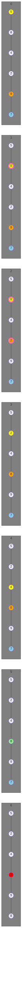
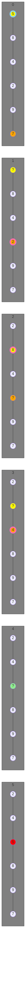

#### ArrayAdjustR

- $left$、$right$、$pivot$、临时锁定、最终命中、锁定

```mermaid
graph LR
    subgraph 6
        style 6 stroke:#333,fill:grey;
        style D6 fill:red;
        A6((5))---
        B6((2))---
        C6((4))---
        D6((7))---
        E6((9))---
        F6((8));
    end
    subgraph 5
        style 5 stroke:#333,fill:grey;
        style F5 fill:skyblue;
        style D5 fill:lightgreen;
        A5((5))---
        B5((2))---
        C5((4))---
        D5((8))---
        E5((9))---
        F5((7));
    end
    subgraph 4
        style 4 stroke:#333,fill:grey;
        style F4 fill:skyblue;
        style C4 fill:yellow;
        style D4 fill:orange;
        A4((5))---
        B4((2))---
        C4((4))---
        D4((8))---
        E4((9))---
        F4((7));
    end
    subgraph 3
        style 3 stroke:#333,fill:grey;
        style F3 fill:skyblue;
        style B3 fill:yellow;
        style D3 fill:orange;
        A3((5))---
        B3((2))---
        C3((4))---
        D3((8))---
        E3((9))---
        F3((7));
    end
    subgraph 2
        style 2 stroke:#333,fill:grey;
        style F2 fill:skyblue;
        style B2 fill:yellow,stroke:hotpink,stroke-width:5px;
        style D2 fill:orange,stroke:hotpink,stroke-width:5px;
        A2((5))---
        B2((8))---
        C2((4))---
        D2((2))---
        E2((9))---
        F2((7));
    end
    subgraph 1
        style 1 stroke:#333,fill:grey;
        style F1 fill:skyblue;
        style B1 fill:yellow,stroke:hotpink,stroke-width:5px;
        style E1 fill:orange;
        A1((5))---
        B1((8))---
        C1((4))---
        D1((2))---
        E1((9))---
        F1((7));
    end
    subgraph 0
        style 0 stroke:#333,fill:grey;
        style F0 fill:skyblue;
        style A0 fill:yellow;
        style E0 fill:orange;
        A0((5))---
        B0((8))---
        C0((4))---
        D0((2))---
        E0((9))---
        F0((7));
    end
```

- 注意在5中，如果$pivot$是大于最终命中值的话是不需要交换的，此时锁定的是其原始所在位置。

#### ArrayAdjustL

- $left$、$right$、$pivot$、临时锁定、最终命中、锁定

```mermaid
graph LR
    subgraph 5
        style 5 stroke:#333,fill:grey;
        style C5 fill:red;
        A5((2))---
        B5((4))---
        C5((5))---
        D5((8))---
        E5((9))---
        F5((7));
    end
    subgraph 4
        style 4 stroke:#333,fill:grey;
        style C4 fill:lightgreen;
        A4((2))---
        B4((4))---
        C4((?))---
        D4((8))---
        E4((9))---
        F4((7));
    end
    subgraph 3
        style 3 stroke:#333,fill:grey;
        style B3 fill:yellow;
        style C3 fill:orange,stroke:hotpink,stroke-width:5px;
        A3((2))---
        B3((?))---
        C3((4))---
        D3((8))---
        E3((9))---
        F3((7));
    end
    subgraph 2
        style 2 stroke:#333,fill:grey;
        style B2 fill:yellow,stroke:hotpink,stroke-width:5px;
        style D2 fill:orange;
        A2((2))---
        B2((8))---
        C2((4))---
        D2((?))---
        E2((9))---
        F2((7));
    end
    subgraph 1
        style 1 stroke:#333,fill:grey;
        style A1 fill:yellow;
        style D1 fill:orange,stroke:hotpink,stroke-width:5px;
        A1((?))---
        B1((8))---
        C1((4))---
        D1((2))---
        E1((9))---
        F1((7));
    end
    subgraph 0
        style 0 stroke:#333,fill:grey;
        style A0 fill:yellow,stroke:skyblue,stroke-width:5px;
        style F0 fill:orange;
        A0((5))---
        B0((8))---
        C0((4))---
        D0((2))---
        E0((9))---
        F0((7));
    end
```
