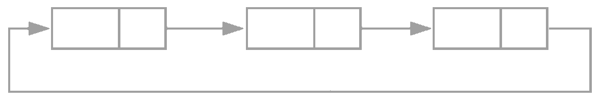
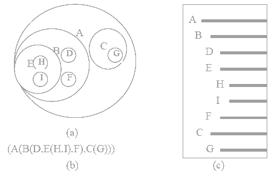

<link rel="stylesheet" href="https://zhmhbest.gitee.io/hellomathematics/style/index.css">
<script src="https://zhmhbest.gitee.io/hellomathematics/style/index.js"></script>

# [数据结构](../index.html)

[TOC]

## 线性表

### 顺序结构

```cpp
typedef struct {
    ElemType* elements;  // 存储位置
    unsigned int size;      // 已用长度
    unsigned int capacity;  // 最大容量
} ArrayList;
```

### 链表结构

**单向链表**：

```cpp
typedef struct LinkedListNode {
    ElemType element;
    struct LinkedListNode* next;
} LLNode;

typedef struct {
    struct LinkedListNode* head;
    unsigned int size;      // 链表长度
} LinkedList;
```

**双向链表**：

```cpp
typedef struct DoubleLinkedListNode {
    ElemType element;
    struct DoubleLinkedListNode* next;
    struct DoubleLinkedListNode* prior;
} DLLNode;

typedef struct {
    struct DoubleLinkedListNode* head;
    struct DoubleLinkedListNode* tail;
    unsigned int size;      // 链表长度
} DoubleLinkedList;
```

**循环链表**：



### 栈

先进后出

```cpp
typedef struct {
    ElemType* base;
    ElemType* top;  // default = base
    // int top;     // default = -1
    unsigned int capacity;
} Stack;

/**
 * 判空
 */
bool isEmpty(Stack* S) {
    return (S->top) == (S->base);
    // return (S->top) == -1;
}

/**
 * 判满
 */
bool isFull(Stack* S) {
    return (S->top) == ((S->base) + (S->capacity));
    // return (S->top) == ((S->capacity) - 1);
}

/**
 * 数量
 */
unsigned int size(Stack* S) {
    return (S->top) - (S->base);
    // return (S->top) + 1;
}

/**
 * 栈顶
 */
ElemType size(Stack* S) {
    if ( (S->top) > (S->base) ) {
        return *((S->top) - 1);
    }
    return NULL;
}

/**
 * Push
 */
bool push(Stack* S, ElemType E) {
    if ( (S->top) < ((S->base) + (S->capacity)) ) {
        *(S->top)++ = E;
        return true;
    }
    return false;
}

/**
 * Pop
 */
ElemType pop(Stack* S) {
    if ( (S->top) > (S->base) ) {
        return *--(S->top);
    }
    return NULL;
}
```

### 队列

先进先出

```cpp
typedef struct {
    ElemType* base;
    unsigned int capacity;
    int front;
    int rear;
} CircularQueue;

/**
 * 判空
 */
bool isEmpty(CircularQueue* Q) {
    return (Q->front) == (Q->rear);
}

/**
 * 判满
 */
bool isFull(CircularQueue* Q) {
    return ((Q->rear) + 1) % (Q->capacity) == (Q->front);
}

/**
 * 数量
 */
unsigned int size(CircularQueue* Q) {
    return ((Q->rear) - (Q->front) + (Q->capacity)) % (Q->capacity);
}

/**
 * 入队
 */
bool enQueue(CircularQueue* S, ElemType E) {
    int nextRear = ((Q->rear) + 1) % (Q->capacity);
    if ( nextRear != (Q->front) ) {
        Q->base[Q->rear] = E;
        Q->rear = nextRear;
        return true;
    }
    return false;
}

/**
 * 出队
 */
ElemType deQueue(CircularQueue* S) {
    if ( (Q->front) != (Q->rear) ) {
        ElemType e = Q->base[Q->front];
        Q->front = ((Q->front) + 1) % (Q->capacity);
        return e;
    }
    return NULL;
}
```

## 串

**空串**：`""`

**字串**：串中任意个连续字符组成的子序列。

### 串的表示

```cpp
/**
 * 定长存储
 * 第一个位置存储字符长度
 */
typedef unsigned char SString[256];

/**
 * 堆分配存储
 */
typedef struct {
    unsigned char* chs;
    unsigned int length;
} HString;

/**
 * 块链存储
 */
struct Chunk {
    unsigned char chs[32];
    struct Chunk* next;
};
typedef struct {
    struct Chunk* head;
    unsigned int length;
} LString;
```

### 串的模式匹配

```cpp
/**
 * 求子串位置
 */
int indexOf(const char* mainStr, const char* findStr) {
    const int N = strlen(mainStr);
    const int M = strlen(findStr);
    int i = 0, j = 0;
    while (i < N && j < M) {
        if (mainStr[i] == findStr[j]) { i++; j++; }
        else { i = i - j + 1; j = 0; }
    }
    return j == M ? i - M : -1;
}

/**
 * KMP算法
 */
// 待补充

int main() {
    printf("%d=8\n", indexOf("Hello, world!", "or"));
}
```

## 树

### 表示方法

树形表示法、嵌套集合表示法、凹入表示法、广义表表示法



### 二叉树

- 第$i$层至多有$2^{i-1}$个节点
- 深度为$k$的二叉树至多有$2^k-1$个节点
- 终端节点数$n_0$，度为$2$的结点数$n_2$，则$n_0 = n_2 + 1$
- $n$个结点的完全二叉树深度为$\lfloor\log_2{n}\rfloor + 1$
- $n$个结点的完全二叉树，从上到下，从左到右编号
  - $i=1$为根节点
  - 若$2i>n$，则结点$i$无左子或左子是结点$2i$
  - 若$2i+1>n$，则结点$i$无右子或右子是结点$2i+1$
  - 最后一个非叶节点为$\lfloor{n/2}\rfloor$


#### 存储结构

顺序存储、链式存储

```cpp
/**
 * 顺序存储
 */
int bt1[] = {1, 2, 3, 4, 5, 6, 7, 8, 9, 10, 11, 12, 13, 14, 15};

/**
 * 链式存储
 */
typedef struct BinaryTreeNode {
    int val;
    struct BinaryTreeNode* left;
    struct BinaryTreeNode* right;
} BinaryTreeNode;
```

#### 遍历

对一个非线性结构进行线性化操作。

```cpp
void Traverse(BinaryTreeNode* root) {
    if(root) {
        printf("前序遍历：%d\n", root->val);
        Traverse(root->left);
        printf("中序遍历%d\n", root->val);
        Traverse(root->right);
        printf("后续遍历%d\n", root->val);
    }
}
```

#### 线索化

增加2个$Tag$表示$Child$存储的是“前驱、后继、左子、右子”。

@import "tables/tree_tag.html"

$lTag =
\begin{cases}
    0 & child\textnormal{\footnotesize 为左子}
\\  1 & child\textnormal{\footnotesize 为前驱}
\end{cases}$，$rTag =
\begin{cases}
    0 & child\textnormal{\footnotesize 为右子}
\\  1 & child\textnormal{\footnotesize 为后继}
\end{cases}$

在有$n$个结点的二叉链表中必定存在$n+1$个空链域。

### 树和森林

#### 树的表示法

双亲表示法、孩子表示法、孩子兄弟表示法

```cpp
/**
 * 双亲表示法
 */
struct ParentTreeNode {
    ElemType data;
    int parent; // Parent在数组中的下标
};
typedef struct {
    struct ParentTreeNode nodes[100];
    int root; // 根在数组中的下标
    int size; // 结点数
} ParentTree;

/**
 * 孩子表示法
 */
struct ChildTreeNode {
    int child; // Child在数组中的下标
    struct ChildTreeNode* next;
};
typedef struct ChildTreeBox {
    ElemType data;
    struct ChildTreeNode* firstChild;
};
typedef struct{
    struct ChildTreeBox nodes[100];//存储结点的数组
    int root; // 根在数组中的下标
    int size; // 结点数
} ChildTree;

/**
 * 孩子兄弟表示法
 */
typedef struct ChildSiblingTreeNode {
    ElemType data;
    struct ChildSiblingTreeNode* firstChild;
    struct ChildSiblingTreeNode* nextSibling;
} CSNode, *CSTree;
```

#### 转化为二叉树

**树转换为二叉树**：

1. 同层相连
2. 每层与上层仅保留最左侧链接

**森林转为二叉树**：

1. 将每颗树转为二叉树
2. 第二颗树作为第一颗的右子树，依次类推

### Huffman

**带权路径长度**：从树根到某一节点的路径长度与该节点的权的乘积。

**构建**：选出最小的两个作为左右子树，构建出一颗新二叉树，其根为两数之和；新根元素替代原有两个元素参与后续构建，重复上述步骤直到不能凑齐两个元素。

**编码**：每条路径权值为0或1（一般左0右1），每个元素编码为从根到该元素所有路径的权值组成的数字。

## 图

### 图的表示法

```cpp
/**
 * 邻接矩阵
 */
typedef struct {
    VertexType vexs[];
    AdjMatrix arcs;
    int vexnum;
    int arcnum;
    GraphKind kind;
} MGraph;
```

### 图的遍历

```cpp

```

## 查找

## [内排序](./InnerSorting/index.html)

### [直接插入排序](./InnerSorting/index.html#直接插入排序)

### [折半插入排序](./InnerSorting/index.html#折半插入排序)

### [简单选择排序](./InnerSorting/index.html#简单选择排序)

### [堆排序](./InnerSorting/index.html#堆排序)

### [冒泡排序](./InnerSorting/index.html#冒泡排序)

### [快速排序](./InnerSorting/index.html#快速排序)
