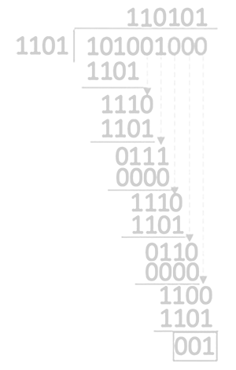

<link rel="stylesheet" href="https://zhmhbest.gitee.io/hellomathematics/style/index.css">

# [差错校验](../index.html)

[TOC]

## 校验原理

### 码字

由若干位代码组成的一个字，叫**码字**。

### 码距

将2个码字逐位进行对比，具有不同位的个数称为**两个码字间的距离**。

一种编码方案可能有若干个合法码字，各合法码字间的最小距离称为**码距**。

- $(00,01,10,11)$的码距为1
- $(100,001,010,111)$的码距为2

码距为$1$的编码方案——没有检错能力；
码距为$2$的编码方案——有检错能力；
码距为$d≥3$的编码方案——有检错能力、纠错能力。

## 校验方法

### 奇偶校验

在高位添加一位，使1的个数为奇数（偶数），称为奇校验（偶校验）。

奇偶校验只能检测到奇数位的错误，且没有纠错能力。

#### 生成校验码

对数据所有位依次进行异或运算，即得该数据偶校验的校验码。

#### 数据校验

对待校验的数据的所有位进行异或运算，若结果为0，则校验通过。

### 海明码（Hamming）

能发现双比特错误，但只能纠正单比特错误。

#### 生成校验码

$$2^k ≥ n + k + 1$$

- $n$: 信息位个数
- $k$: 校验位个数

@import "tables/hamming_k.csv"

校验位依次放于$2^{i-1}, { \ \ \ } i=1,2,\cdots$的位置上；
信息位按顺序放到其余位置；
首部添加全校验位（对整体进行偶校验）。

##### 例

信息位`1010`，求校验码。

$n=4 { \ \ \ ⇒ \ \ \ } k=3$

| 序列 |7|6|5|4|3|2|1|
|-|-|-|-|-|-|-|-|
| 数据 |$1$ | $0$ | $1$ | $P_3$ | $0$ | $P_2$ | $P_1$|

|| $P_3$ | $P_2$ | $P_1$ |
|-|-|-|-|
| $\bold3$ | $0$ | $1$ | $1$ |
| $\bold5$ | $1$ | $0$ | $1$ |
| $\bold6$ | $1$ | $1$ | $0$ |
| $\bold7$ | $1$ | $1$ | $1$ |
| $P_i$ | $1⊕0⊕1=0$ | $0⊕0⊕1=1$ | $0⊕1⊕1=0$ |

### 循环冗余检验（CRC）

#### 生成校验码

求CRC，即在数据末尾补$(\textnormal{\footnotesize 生成多项式长度}-1)$个$0$后对生成多项式进行**模二除**运算。

##### 例

待发送数据`11 0101 1011`，生成多项式`1 0011`，则冗余码（FCS）为

