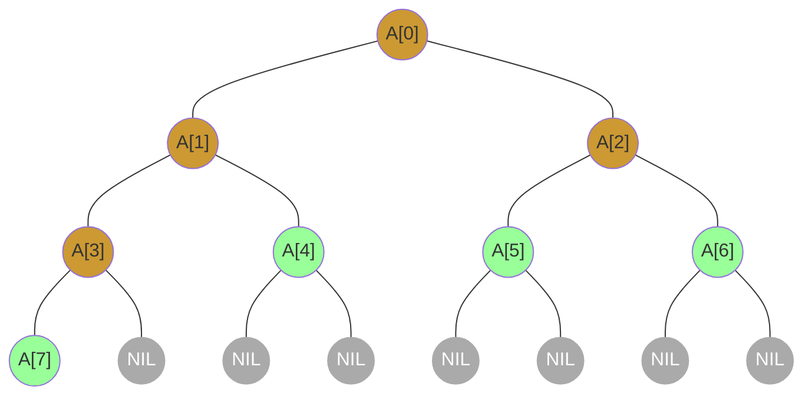
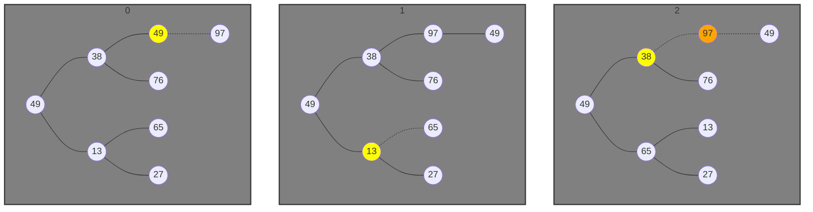
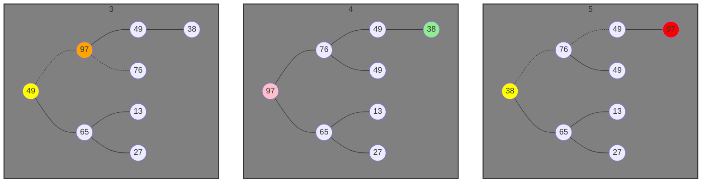

#### ArrayToHeap

- $\textnormal{\footnotesize 左子序} = \textnormal{\footnotesize 父序} × 2 + 1$
- $\textnormal{\footnotesize 右子序} = \textnormal{\footnotesize 父序} × 2 + 2$
- <span style="color: #CC9933">非叶序区间：$\big[0, L / 2 - 1]$</span>
- <span style="color: #99FF99">叶子序区间：$\big[L / 2, L - 1\big]$</span>

```c
int A[] = {?, ?, ?, ?, ?, ?, ?, ?};
//    I = {0, 1, 2, 3, 4, 5, 6, 7};
//    L = 8;
```



#### HeapAdjust

```c
int A[] = {49, 38, 13, 49, 76, 65, 27, 97};
// 构建大顶堆后
int R[] = {97, 76, 65, 49, 49, 13, 27, 38};
```

- <span style='color: yellow'>当前调整节点</span>、<span style='color: orange'>被传递调整的节点</span>、<span style='color: pink'>栈顶最值</span>、<span style='color: lightgreen'>取代栈顶的元素</span>、<span style='color: red'>冻结</span>





- 0-4为构建大顶堆（需要从最后一个非叶结点到根结点进行`HeapAdjust`）；
- 4为构建大顶堆的结果；
- 从4开始为选择最大值排序，后续每次仅需对根节点进行`HeapAdjust`即可。
