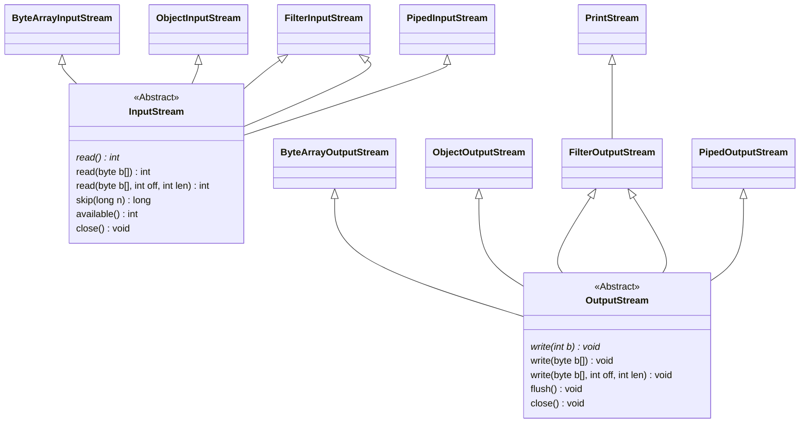
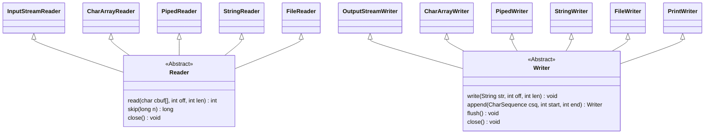

<!-- ### IO -->

`InputStream`、`OutputStream`



&nbsp;

`Reader`、`Writer`



&nbsp;

```java
import java.io.*;

public class Main {
    public static void main(String[] args) throws IOException {
        // 标准输出流
        PrintStream writer = System.out;

        // 输出内容到缓冲
        ByteArrayOutputStream os = new ByteArrayOutputStream(64);
        OutputStreamWriter osw = new OutputStreamWriter(os);
        osw.write("Hello!\n");
        osw.write("This is Stream.\n");
        osw.write("Bye!.\n");
        osw.close();

        // 打印缓冲的内容到控制台
        byte[] data = os.toByteArray();
        writer.println(new String(data));

        // 读取内容到缓冲
        char[] buffer = new char[64];
        InputStream is = new ByteArrayInputStream(data);
        InputStreamReader isr = new InputStreamReader(is);
        int size = isr.read(buffer);
        isr.close();

        // 打印缓冲的内容到控制台
        writer.println(new String(buffer, 0, size));
    }
}
```

### 字节流与字符流

|        | 单位   |
| -----: | :----: |
| 字节流 | `byte` |
| 字符流 | `char` |

### BIO、NIO、AIO

|         |     说明     | 特点                               |
| ------: | :----------: | :--------------------------------- |
| **BIO** | 同步阻塞式IO | 模式简单使用方便，并发处理能力低。 |
| **NIO** | 同步非阻塞IO | 通过Channel通讯，实现了多路复用    |
| **AIO** | 异步非阻塞IO | 异步IO                             |
