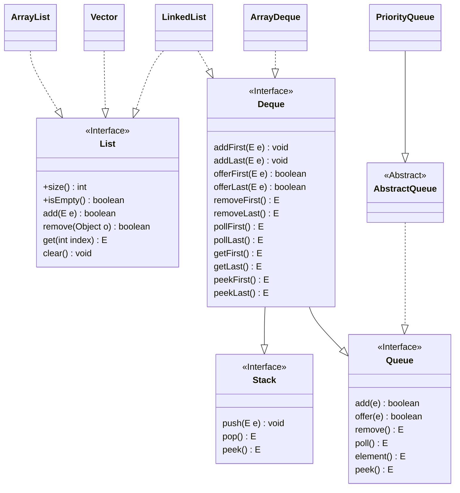
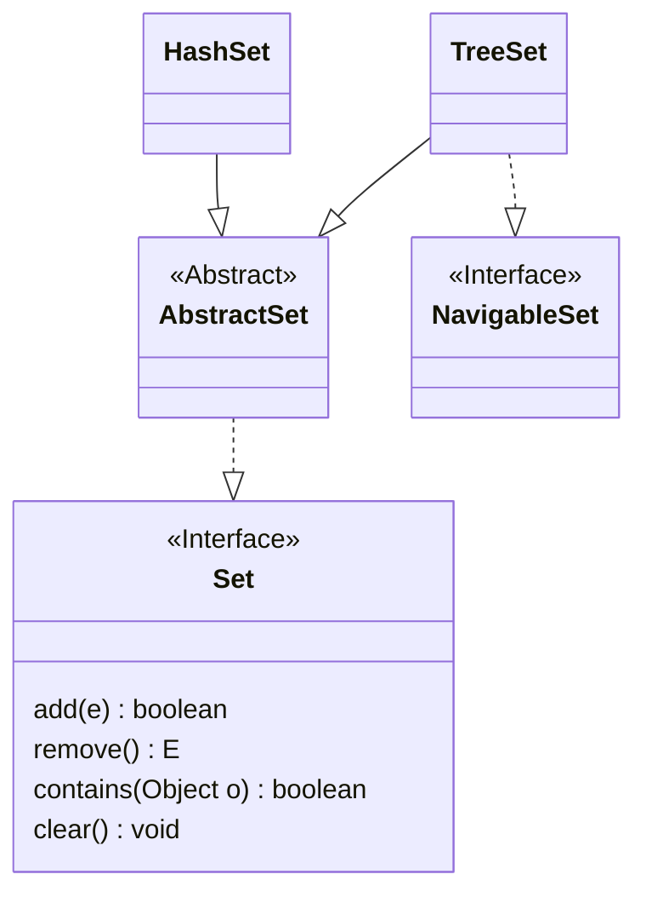
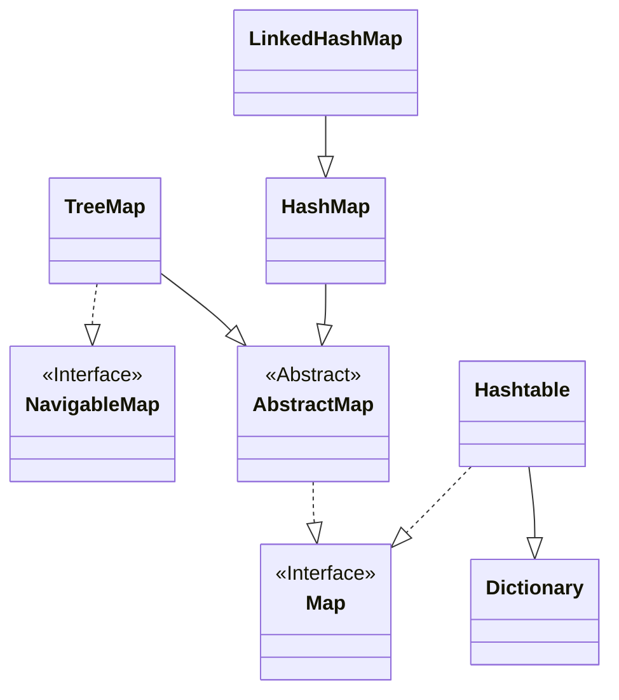

<!-- ### Collection -->



&nbsp;



&nbsp;



|            | 数据结构 | 线程安全性 | 扩容机制 |
| ---------: | :------: | :--------- | -------- |
|  ArrayList |   数组   | 不安全     | 1.5倍    |
|     Vector |   数组   | 安全       | 2.0倍    |
| LinkedList |   链表   | 不安全     | 无       |

|               | 数据结构 |
| ------------: | :------: |
|    ArrayDeque | 循环数组 |
| PriorityQueue |  小顶堆  |
|    LinkedList | 双向链表 |

|         | 数据结构 | 特点                   |
| ------: | :------: | ---------------------- |
| TreeSet |  二叉树  | 元素有序               |
| HashSet |  哈希表  | 元素无序、可放入null值 |

|               | 数据结构                 | 线程安全 | 特点                       |
| ------------: | :----------------------- | :------: | -------------------------- |
|       HashMap | 散列表、单链表/红黑树    |    无    | `key`和`value`可以为`null` |
| LinkedHashMap | 散列表、单链表、双向链表 |    无    | 双向链表维护键值对的顺序   |
|       TreeMap | 红黑树                   |    无    |                            |
|     Hashtable | 散列表、单链表           |    有    |                            |

```java
// 迭代List
List<String> list = new ArrayList<String>(){{
    add("A"); add("B"); add("C");
}};
Iterator<String> it = list.iterator();

// 方法1
while (it.hasNext()) {
    System.out.printf("%s ", it.next());
}
System.out.print('\n');

// 方法2
for (String item : list) {
    System.out.printf("%s ", item);
}
```
