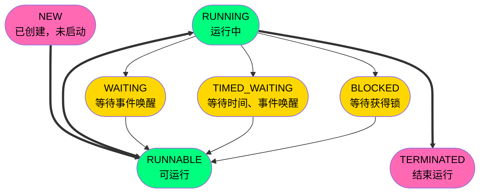

### 相关方法



```mermaid
classDiagram
    class State {
        <<Enumeration>>
        NEW
        RUNNABLE
        BLOCKED
        WAITING
        TIME_WAITING
        TERMINATED
    }

    class Object {
        wait() void
        notify() void
        notifyAll() void
    }

    class Thread {
        sleep(long millis)$ void
        yield()$ void
        join() void

        setName(String name) void
        getName() String

        setPriority(int newPriority) void
        getPriority() int

        getId() long
        getState() State

        setDaemon(boolean on) void
        isDaemon() boolean

        interrupt() void
        isInterrupted() boolean

        isAlive() boolean
        start() void
        stop() void
        run() void
    }

    class Runnable {
        <<Interface>>
        run()* void
    }

    Thread --|> Object
    Thread ..|> Runnable
````

|             Thread的成员方法 | 说明                                                      |
| ---------------------------: | :-------------------------------------------------------- |
|         `setName`、`getName` | 设置/获取线程名称                                         |
| `setPriority`、`getPriority` | 设置/获取线程优先级                                       |
|                      `getId` | 获取线程ID                                                |
|                   `getState` | 获取线程状态                                              |
|      `setDaemon`、`isDaemon` | 守护线程                                                  |
| `interrupt`、`isInterrupted` | 设置/获取中断信号                                         |
|                    `isAlive` | 线程是否在运行                                            |
|                      `start` | 启动线程                                                  |
|                       `stop` | 停止线程（弃用）                                          |
|                        `run` | <span style="color:red">直接调用方法而不是启动线程</span> |

| 多线程控制 | 让出CPU                                                 | 释放锁                                                      | 当前线程进入阶段                                              | 说明                                                |
| ---------: | :--------: | :--------: | :--------: | :--------- |
|    `Thread.sleep` | √    | ×        | TIMED_WAITING | 等待指定时间 |
|    `Thread.yield` | √ | × | RUNNABLE | 仅能让与同级或更高级 |
|            `object.wait` | √ | √ | WAITING | 必须放在循环体和同步代码块中 |
| `thread.join` | √ | √ | BLOCKED | 指定线程结束后再执行本线程 |
|     `object.notify` | -  | -  | -  | 随机唤醒对象的等待池中的一个线程 |
|  `object.notifyAll` | -      | -      | -      | 唤醒对象的等待池中的所有线程 |

### 多线程实现方法

```java
import lombok.SneakyThrows;

import java.util.concurrent.Callable;
import java.util.concurrent.FutureTask;

public class Main {
    static class A extends Thread {
        @SneakyThrows
        @Override
        public void run() {
            for (int i = 0; i < 6; i++) { System.out.printf("A-%d\n", i); Thread.sleep(100); }
        }
    }

    static class B implements Runnable {
        @SneakyThrows
        @Override
        public void run() {
            for (int i = 0; i < 6; i++) { System.out.printf("B-%d\n", i); Thread.sleep(100); }
        }
    }

    static class C implements Callable {
        @Override
        public Integer call() throws Exception {
            for (int i = 0; i < 6; i++) { System.out.printf("C-%d\n", i); Thread.sleep(10); }
            return -1;
        }
    }

    public static void main(String[] args) throws Exception {
        // 1.继承Thread
        new A().start();
        // 2.实现Runnable
        new Thread(new B()).start();
        // 3.实现Callable：有返回值
        FutureTask<Integer> task = new FutureTask<Integer>(new C());
        new Thread(task).start();
        // 4.从线程池获取
        // 略

        // Main
        for (int i = 0; i < 6; i++) { System.out.printf("D-%d\n", i); Thread.sleep(100); }
        // FutureTask + Callable 获取线程运行后的返回值
        Integer result = task.get();
        System.out.println(result);
    }
}
```

### 线程安全

- 原子性：同一时刻只能有一个线程对数据进行操作（`Atomic`、`synchronized`）
- 可见性：线程对主内存的修改可以及时地被其他线程看到（`synchronized`、`volatile`）
- 有序性：一个线程观察其他线程中的指令执行顺序，由于指令重排序，该观察结果一般杂乱无序

|                          | 说明                                                         |
| -----------------------: | :----------------------------------------------------------- |
|               `volatile` | 前变量在寄存器（工作内存）中的值是不确定的，需要从主存中读取。<br>仅能实现原始变量（`boolean`、 `short` 、`int` 、`long`）的修改可见性，不能保证原子性。<br>标记的变量不会被编译器优化。 |
|           `synchronized` | 锁定当前变量，只有当前线程可以访问该变量，其他线程被阻塞住。<br/>可以保证变量的修改可见性和原子性。<br/>可能会造成线程的阻塞。 |
|           `AtomicObject` | 多个线程同时对该变量的值进行更新时仅有一个成功，<br>未成功的线程继续尝试，直等到执行成功。 |
|          `ReentrantLock` | 自定义`lock`和`unlock`的时机。                               |
| `ReentrantReadWriteLock` | 允许多个读线程同时访问，但是不允许“写+读”、“写+写”同时访问。<br>读写锁内部维护了两个锁：ReadLock、WriteLock |
|              `Semaphore` | 信号量机制、可以指定多个线程同时访问某个资源                 |

```java
static class VolatilePlus {
    volatile int index = 0;
    public int number() { return index; }
    // 包括取值，回写两个步骤
    // volatile仅能保证取值的原子性
    public void plus() { index = index + 1; }
}

static class SynchronizedPlus {
    int index = 0;
    public int number() { return index; }
    public synchronized void plus() { index++; }
}

static class AtomicPlus {
    AtomicInteger index = new AtomicInteger();
    public int number() { return index.get(); }
    public void plus() { index.getAndIncrement(); }
}

static class LockPlus {
    final Lock lock = new ReentrantLock(); // 定义一个锁
    int index = 0;
    public int number() { return index; }
    public void plus() {
        lock.lock(); // 获取锁
        try { index++; }
        finally { lock.unlock(); } // 释放锁
    }
}
```

#### 线程同步

```java
public class Main {
    static class OrderedThreads {
        public interface CoreBlock {
            /**
             * @param name 线程名称
             * @param size 循环次数
             * @param prev 前一个线程对象
             * @param self 当前线程对象
             */
            void run(final char name, final int size, final Thread prev, final Thread self) throws InterruptedException;
        }
        public static void start(final int threadSize, final int loopSize, CoreBlock core) throws InterruptedException {
            Thread[] threads = new Thread[threadSize];
            // 创建所有线程
            for (int i = 0; i < threadSize; i++) {
                final int k = i;
                threads[i] = new Thread(() -> {
                    try {
                        core.run((char) ('A' + k), loopSize, threads[(k - 1 + threadSize) % threadSize], threads[k]);
                    } catch (InterruptedException e) {
                        e.printStackTrace();
                    }
                });
            }
            // 启动所有线程
            for (Thread thread : threads) {
                thread.start();
                Thread.sleep(10); // 保证线程依次运行
            }
        }
    }
    public static void main(String[] args) throws InterruptedException {
        OrderedThreads.start(6, 10, (name, size, prev, self) -> {
            int i = 0;
            for (;;) {
                synchronized (prev) {       // prev没有释放，self不会执行
                    synchronized (self) {   // self没有释放，next不会执行
                        System.out.printf("%s-%d\n", name, i);
                        i++;
                        self.notifyAll();   // 唤醒其它竞争self锁的线程（即唤醒next）
                    }
                    if (i < size) {
                        prev.wait();        // 立即释放prev对象锁，同时self休眠等待被prev唤醒
                    } else {
                        prev.notifyAll();
                        break;
                    }
                }
            }
        });
    }
}
```

### 线程池

|                                    | 说明                                                         |
| ---------------------------------: | ------------------------------------------------------------ |
|                  `FixedThreadPool` | 创建一个固定大小的线程池，可控制并发的线程数，超出的线程会在队列中等待。 |
|                 `CahcedThreadPool` | 可缓存的线程池，若线程数超过处理所需，缓存一段时间后会回收，若线程数不够，则新建线程。 |
|             `SingleThreadExecutor` | 创建单个线程数的线程池，它可以保证先进先出的执行顺序。       |
|              `ScheduledThreadPool` | 创建一个可以执行延迟任务的线程池。                           |
|                                    |                                                              |
|    `SingleThreadScheduledExecutor` | 创建一个单线程的可以执行延迟任务的线程池。                   |
| `WorkStealingPoolWorkStealingPool` | 创建一个抢占式执行的线程池（任务执行顺序不确定）。           |
|               `ThreadPoolExecutor` | 原始的创建线程池的方式                                       |

```java
ExecutorService fixedThreadPool = Executors.newFixedThreadPool(2);
ExecutorService cachedThreadPool = Executors.newCachedThreadPool();
ExecutorService singleThreadExecutor = Executors.newSingleThreadExecutor();
ExecutorService scheduledThreadPool = Executors.newScheduledThreadPool(5);
//
ExecutorService singleThreadScheduledExecutor = Executors.newSingleThreadScheduledExecutor();
ExecutorService workStealingPool = Executors.newWorkStealingPool();
ThreadPoolExecutor threadPool = new ThreadPoolExecutor(5, 10, 100, TimeUnit.SECONDS, new LinkedBlockingQueue<>(10));
```
