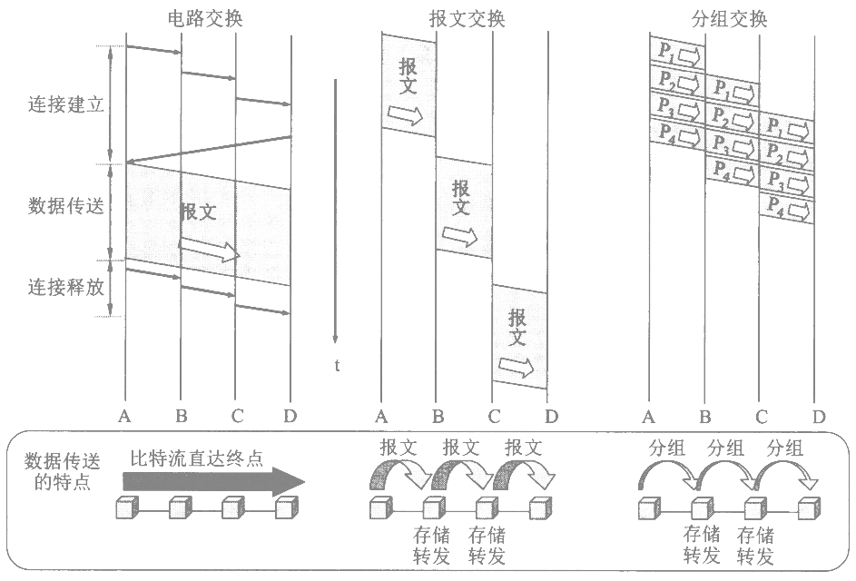

**网络层功能**：异构网络互联、拥塞控制、路由选择与分组转发、尽最大努力交付

**数据交换方式**：

### IP

#### IP数据报

@import "tables/ip_v4_head.html"

#### 分类IP地址

@import "tables/ip_v4.html"

**网络范围**

- A：1~126
- B：128~191
- C：192~223

**私有IP地址**

- A：[10.0.0.0, 10.255.255.255]
- B：[172.16.0.0, 172.31.255.255]
- C：[192.168.0.0, 192.168.255.255]

#### 子网划分

@import "tables/subnet.html"

$\textnormal{\footnotesize 网络地址} = \textnormal{\footnotesize IP地址} { \ \& \ } \textnormal{\footnotesize 子网掩码}$

#### CIDR

@import "tables/cidr.html"

记法：IP地址/前缀长度

主机号不能纯0或纯1

@import "app/cidr.html"

#### IPV6

@import "tables/ip_v6_head.html"

### ARP

地址解析协议（ARP），用于维护一个从IP地址到MAC地址的映射表。

ARP协议默认每台主机在向网络中发送应答信号时都使用的是真实身份（如若不然，则会产生ARP欺诈）。

### ICMP

用于在IP主机、路由器之间传递控制消息。`ping`、`traceroute`/`tracert`等命令皆基于此协议。

### Router

**路由表**：

| 目的网络IP | 子网掩码 | 下一跳IP | 接口 |
| - | - | - | - |

**路由选择协议**：

- 外部网关协议（EGP）
  - 边界网关协议（BGP）
- 内部网关协议（IGP）
  - 开放式最短路径优先（OSPF）
    - 当**链路状态变化**时，使用洪泛法，向所有**相邻路由器**发送**与所有相邻路由器的链路状态**信息；
    - 所有自治系统内的路由器最终都能建立一个全网状态拓扑图；
  - 距离向量路由算法（RIP）
    - 维护从自身到每个目的网络的唯一最佳距离记录（跳数）；
    - 一条路由最多包含15跳，超过表示不可达；
    - 仅和相邻的路由器交换信息（每30秒）；
    - 好消息传播快，坏消息传播慢（慢收敛）；

|  | RIP | OSPF | BGP |
| - | - | - | - |
| 范围 | 内部 | 内部 | 外部 |
| 路由算法 | 距离向量 | 链路状态 | 距离向量 |
| 传递协议 | UDP | IP | TCP |
| 路径选择 | 跳数最少 | 代价最低 | 较好（非最佳） |
| 交换节点 | 相邻路由器 | 自治系统全网 | 相邻路由器 |
| 交换内容 | 路由表 | 与所有相邻路由器的链路状态 | 首次：路由表 非首次：变化部分 |

### 广域网

相关技术：

- 专线技术
- 公用电话网
- 公用分组交换数据网
- 综合也无数字网
- 帧中继FR
- ATM技术（异步传输模式）建立在电路交换和分组交换的基础上，以信元为基础。
