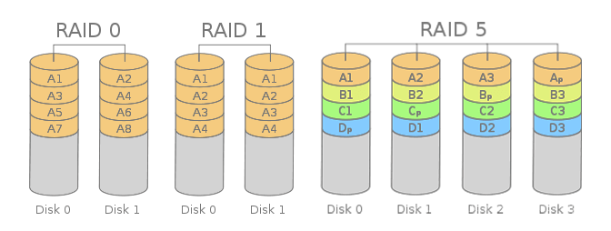

### 磁盘

#### 磁盘读写耗时

- 寻道时间：启动磁臂、移动磁头
- 延迟时间：目标扇区转到磁头下面
- 传输时间：读/写数据花费的时间

#### 磁盘调度算法

|                         算法 | 说明                                                         |
| ---------------------------: | :----------------------------------------------------------- |
|       **先来先服务（FCFS）** |                                                              |
| **最短寻找时间优先（SSTF）** | 仅能保证眼前最优，无法保证总体最优，且可能导致饥饿           |
|         **扫描算法（SCAN）** | 磁头移动到最边缘的磁道时才可改变磁头移动方向                 |
|                         LOOK | 磁头移动方向上不再有请求，就立即改变磁头移动方向             |
|       **循环扫描（C-SCAN）** | 磁头朝某方向移动时才会响应请求，移动到边缘后立即让磁头折回起点 |
|                       C-LOOK | 只有在磁头移动方向上不再有请求，就立即让磁头返回             |

#### 数据交付方式

- 数据交付：交付磁盘高速缓存中的数据
- 指针交付：交付磁盘高速缓存的一块区域的指针

#### 减少延迟方法

- 提前读
- 延迟写
- 优化物理分布
  - 交替编号：编号相邻的扇区物理上不相邻
  - 错位命名：相邻盘面的扇区编号错位
  - 地址结构设计：使用`(柱面号, 盘面号, 扇区号)`结构以减少移动磁头次数
- 虚拟盘

#### 磁盘初始化

- 初始化
  - 低级格式化：划分扇区
  - 磁盘分区
  - 逻辑格式化：建立文件系统
- 引导块：存放自举程序
- 坏块管理
  - 逻辑格式化时将坏块标记出来
  - 维护一个坏块链，管理备用扇区

### 磁盘容错

#### 磁盘冗余阵列

|   RAID等级 | 速度 | 容错 |     可用容量     | 磁盘数   | 说明               |
| ---------: | :--: | :--: | :--------------: | :------- | ------------------ |
| **RAID-0** |  ↑↑  |  ×   |     $100\%$      | $n≥1$    | 双区域并行交叉存取 |
| **RAID-1** |  -   |  √   |      $50\%$      | $n=2N^+$ | 提供磁盘镜像功能   |
| **RAID-5** |  ↑   |  √   | $\dfrac{n-1}{n}$ | $n≥3$    | 分布奇偶校验条带   |

#### 磁盘容错技术

- `STF-Ⅰ`：双份目录双份文件、写后读校验
- `STF-Ⅱ`：磁盘镜像、磁盘双工
- `STF-Ⅲ`：双机热备、双机互备、公用磁盘
