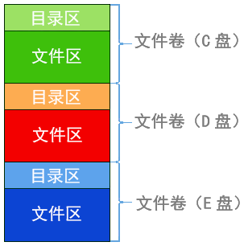

**文件系统**：由文件管理有关软件、被管理文件、实施管理所需的数据结构等组成。

**文件数据**：

- `数据项`：字母或数字等基本数据单位
- `文件属性`：文件类型、长度、位置、建立时间等附加信息
- `记录 = 数据项的集合`
- `文件 = 记录 + 文件属性`

**文件共享方式**：

- 硬链接：基于有向无循环图，用户目录项指向同一个索引结点
- 软链接/符号链接：Link型文件记录共享文件所在位置

**文件保护方式**：

- 口令保护
- 加密保护
- 访问控制：用**访问控制表ACL**记录各用户/组对文件的权限

**文件系统层次结构**：

- 用户接口
- 文件目录系统
- 存取控制模块
- 逻辑文件系统与文件信息缓冲区
- 物理文件系统
  - 辅助分配模块
  - 设备管理器
    - 设备

### 文件存储空间管理

主要解决如何为新文件分配存储空间的问题。

**文件存储空间划分**：逻辑卷/文件卷、目录区（文件目录、空闲表、位示图、超级块）、文件区

|   管理方法 | 特点                                         |
| ---------: | :------------------------------------------- |
|   空闲表法 | 连续分配方式                                 |
| 空闲盘块链 | 以盘块为单位组成一条空闲链                   |
| 空闲盘区链 | 以盘区为单位组成一条空闲链                   |
|   位示图法 | 每个盘块对应一个二进制位                     |
| 成组链表法 | 空闲盘块分组成链，UNIX采用，适合大型文件系统 |

### 文件逻辑结构

**有结构文件**由记录组成，又称记录式文件，记录分为**定长记录**和**可变长记录**。

- 顺序文件
  - 串结构：记录间顺序与关键字无关
  - 顺序结构：纪录间顺序按关键字顺序排列
    - 定长记录：可以实现随机存取，可以快速检索
    - 可变长记录：无法实现随机存取
- 索引文件：为了实现可变长记录的快速检索
  - 建立索引表`(索引号, 长度, 指针)`，索引表本身是定长记录的顺序文件
  - 若索引表按关键字顺序排列则可支持快速检索
- 索引顺序文件：将记录分组，每组对应一个索引表项

### 文件目录结构

**文件目录**：一个文件对应一个FCB、一个FCB就是一个目录项，多个FCB组成文件目录。

**索引结点**：除文件名之外所有信息都放到索引节点中，每个文件对应一个索引结点。

**目录查询方法**：线性检索、Hash方法

**目录结构**：

- 单极：不允许文件重名
- 两级：不同用户文件可以重名，但不能对文件进行分类
- 多级（树形）：不方便文件共享，包含相对路径和绝对路径
- 无环图：共享结点设置共享计数器，计数器为0时才删除结点

### 文件物理结构

包括：顺序结构、链式结构、索引结构。

|          | 实现                                          | 目录                    | 优点                                                       | 缺点                                 |
| -------- | --------------------------------------------- | ----------------------- | ---------------------------------------------------------- | ------------------------------------ |
| 连续分配 | 文件在磁盘占有连续的块                        | `起始块号`,`文件长度`   | 支持随机访问， 顺序存取速度快                          | 会产生碎片，不方便扩展               |
| 隐式链接 | 块中包含指向下一块的指针                      | `起始块号`,`结束始块号` | 方便扩展， 不会有碎片，外存利用率高                    | 只支持顺序访问                       |
| 显式链接 | 文件分配表FAT记录了 物理块指针并常驻内存   | `起始块号`              | 支持随机访问， 方便扩展， 不会有碎片，外存利用率高 | FAT会占用内存空间                    |
| 链接索引 | 索引表链接存放                                | `第一个索引块块号`      | 支持随机访问， 方便扩展                                | 大文件索引表很长                     |
| 多层索引 | 一级索引表指向二级索引表…                     | `顶层索引块块号`        | 支持随机访问， 方便扩展                                | 小文件也要多次访问磁盘找到下级索引表 |
| 混合索引 | 索引表既存放物理块指针 也存放下一级索引表 | `顶层索引块块号`        | 支持随机访问， 方便扩展， 小文件访磁盘次数更少     |                                      |
