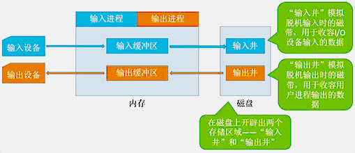

### IO设备分类

- 块设备：传输快，可寻址
- 字符设备：传输慢，不可寻址，常采用中断驱动方式

### IO控制器

**功能**：接受和识别CPU发出的命令、向CPU报告设备状态、数据交换、地址识别

**组成**：CPU与控制器接口、IO逻辑、控制器与设备之间的接口

**寄存器编址方式**：内存映射I/O、寄存器独立编址

#### IO控制方式

|                  | 过程                                                         | CPU干预频率 | 数据传输单位 | 数据流向                          |
| ---------------: | :----------------------------------------------------------- | :---------- | :----------- | :-------------------------------- |
| 程序直接控制方式 | CPU发出I/O命令后需要**不断轮询**                             | 极高        | 字           | 设备→CPU→内存； 内存→CPU→设备 |
|     中断驱动方式 | CPU发出I/O命令后可以做其他事， 本次I/O完成后**设备控制器**发出中断信号 | 高          | 字           | 设备→CPU→内存； 内存→CPU→设备 |
|          DMA方式 | CPU发出命令后可以做其他事， 本次I/O完成后**DMA控制器**发出中断信号 | 中          | 块           | 设备→内存； 内存→设备         |
|     通道控制方式 | CPU发出I/O命令后可以做其他事， 通道会执行通道程序以完成I/O， 完成后**通道向CPU**发出中断信号 | 低          | 一组块       | 设备→内存； 内存→设备         |

### IO层次结构

- 用户层：库函数、假脱机技术（SPOOLing技术）
- 设备独立性软件：系统调用、IO调度、设备保护、设备分配与回收、缓冲区管理
- 设备驱动程序
- 中断处理程序
- 硬件

#### 假脱机技术

用软件方式模拟脱机技术

#### 设备分配与回收

**分配时考虑因素**：设备固有属性、设备分配算法、分配中安全性。

**静态分配**：运行前分配全部资源，运行结束后归还。

**动态分配**：进程运行过程中动态申请设备资源。

**相关数据结构**：设备控制表（DCT）、控制器控制表（COCT）、通道控制表（CHCT）、系统涉笔表（SDT）。

**设备分配步骤**：用户编程时使用**逻辑设备名**，OS通过物理设备名映射表（LUT）实现从逻辑设备名到**物理设备名**的映射。

#### 缓冲区管理

- 单缓冲
- 双缓冲
- 循环缓冲
- 缓冲池
