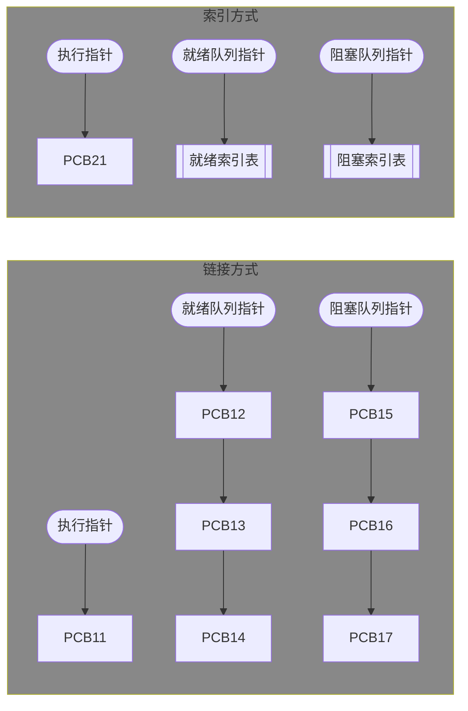
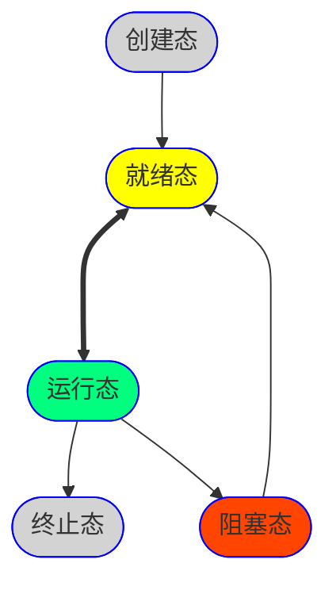
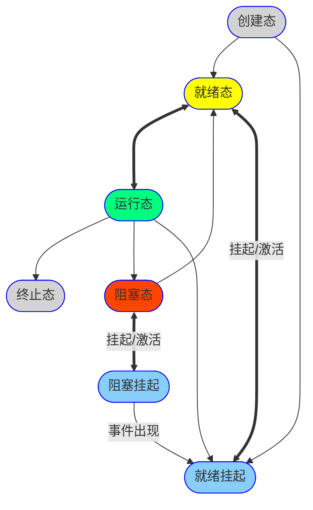

### 进程

#### 进程实体

$$\textnormal{\footnotesize 进程实体（进程映像）} = \{\textnormal{\footnotesize 程序段（程序代码）}, \textnormal{\footnotesize 数据段（程序运行时数据）}, PCB\}$$

- $PCB$包含了进程的描述信息、流程和管理信息、资源分配清单、处理机相关信息。
- **创建进程**就是创建进程实体中的PCB。
- **撤销进程**就是撤销进程实体中的PCB。

#### 进程的定义

进程是进程实体的运行过程，是系统进行资源分配和调度的一个独立单位。

#### 进程的组织

#### 进程的特征

- 动态性：最基本特征
- 并发性
- 独立性：资源分配、调度的独立单位
- 异步性：不可预知的速度推进，可能导致结果的不确定性
- 结构性

#### 进程的状态

- 运行态：独占CPU的一个物理内核运行
- 就绪态：已具备运行条件（运行所需资源），等待CPU空闲即可执行
- 阻塞态：等待事件触发后进入就绪态
- 创建态：OS为进程分配资源、初始化PCB
- 终止态：OS回收进程资源，撤销PCB

相关原语：创建、终止、阻塞、唤醒、切换。

#### 进程通信

- 管道通信：半双工通信，没有写满不能读，没有读空不能写。
- 消息传递
  - 直接通信：直接挂到接受进程的消息缓冲队列
  - 间接通信：先发送到信箱

### 线程

>没有引入线程时，传统的进程是程序执行流的最小单位。

**进程是资源分配的基本单位**；**线程是调度的基本单位**。同一进程的线程间并发不需要切换进程的运行环境。

#### 线程的实现方式

|                | 用户级线程（协程） |  内核级线程  |
| -----------------: | :----------------: | :----------: |
|             维护者 |      应用程序      | 操作系统内核 |
|         线程切换态 |       用户态       |    核心态    |
|     操作系统可见性 |       不可见       |     可见     |
|     等效实际调度数 |         否         |      是      |
|           管理开销 |         小         |     较大     |

#### 多线程模型

| 用户线程与内核级线程 | 优点           | 缺点           |
| -------------------: | :------------- | :------------- |
|               多对一 | 线程管理开销小 | 并发不高       |
|               一对一 | 并发高         | 线程管理成本高 |
|               多对多 |                |                |

### 调度

|                       |   方向    | 发生频率 | 状态变化         |                            |
| --------------------: | :-------: | :------: | :--------------- | -------------------------- |
| **高级调度/作业调度** | 外存→内存 |   最低   | 无→创建态→就绪态 | 将外存后备队列作业加入内存 |
| **中级调度/内存调度** | 外存→内存 |   中等   | 挂起态→就绪态    | 将挂起进程数据调回内存     |
| **低级调度/进程调度** | 内存→CPU  |   最高   | 就绪态→运行态    | 为就绪队列分配处理机       |

#### 进程调度时机

- 主动放弃：异常、IO操作
- 被动放弃：时间片耗尽、高优先进程进入就绪队列

#### 进程调度方式

- 非剥夺调度方式：只允许主动放弃
- 剥夺调度方式（抢占式）

#### 调度算法性能指标

$\textnormal{\footnotesize 周转时间} = \textnormal{\footnotesize 作业完成时间} - \textnormal{\footnotesize 作业提交时间}$

$\textnormal{\footnotesize 平均周转时间} = \dfrac{\textnormal{\footnotesize 各作业周转时间之和}}{\textnormal{\footnotesize 作业数}}$

$\textnormal{\footnotesize 带权周转时间} = \dfrac{\textnormal{\footnotesize 作业周转时间}}{\textnormal{\footnotesize 作业实际运行时间}}$

$\textnormal{\footnotesize 平均带权周转时间} = \dfrac{\textnormal{\footnotesize 各作业带权周转时间之和}}{\textnormal{\footnotesize 作业数}}$

$\textnormal{\footnotesize 等待时间} = \textnormal{\footnotesize 作业处于等待处理机状态时间之和}$

$\textnormal{\footnotesize 响应时间} = \textnormal{\footnotesize 从用户提交请求到首次产生响应所用的时间}$

#### 调度算法

|                | FCFS（先来先服务） | SJF（短作业优先） | HRRN（高响应比优先） |
| -------------: | :----------------: | :---------------: | :------------------: |
|       是否抢占 |         否         |      默认否       |          否          |
| 是否会导致饥饿 |         否         |        是         |          否          |
|           缺点 |    对短作业不利    |   对长作业不利    |         折中         |

|                |  时间片轮换  |  优先级调度  | 多级反馈队列 |
| -------------: | :----------: | :----------: | :----------: |
|       是否抢占 |      是      |     均可     |      是      |
| 是否会导致饥饿 |      否      |      是      |      是      |
|           缺点 | 频繁切换开销 | 可能导致饥饿 |     折中     |
