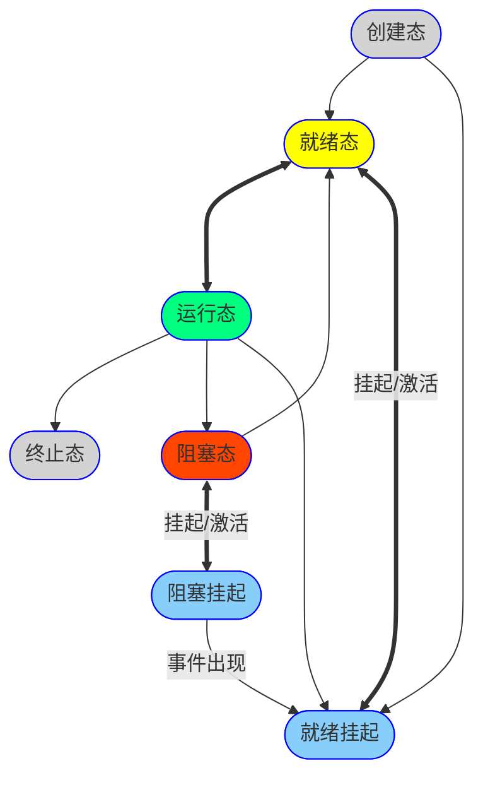

### 调度

**挂起**：暂时被淘汰出内存的进程。

**调度算法准则**：面向用户准则（周转时间短、响应时间快、截止时间保证、优先权准则）、面向系统准则（吞吐量高、处理机利用率高、各资源的平衡利用）

**进程调度时机**：主动放弃（异常、IO操作）、被动放弃（时间片耗尽、高优先进程进入就绪队列）

**进程调度方式**：非抢占式调度算法（非抢占式轮换调度算法、非抢占式优先调度算法）、抢占式调度算法（基于时钟中断的抢占式优先权调度算法、立即抢占的优先级调度算法）

非剥夺调度方式（只允许主动放弃）、剥夺调度方式（抢占式）

#### 调度算法性能指标

$\textnormal{\footnotesize 周转时间} = \textnormal{\footnotesize 作业完成时间} - \textnormal{\footnotesize 作业提交时间}$

$\textnormal{\footnotesize 平均周转时间} = \dfrac{\textnormal{\footnotesize 各作业周转时间之和}}{\textnormal{\footnotesize 作业数}}$

$\textnormal{\footnotesize 带权周转时间} = \dfrac{\textnormal{\footnotesize 作业周转时间}}{\textnormal{\footnotesize 作业实际运行时间}}$

$\textnormal{\footnotesize 平均带权周转时间} = \dfrac{\textnormal{\footnotesize 各作业带权周转时间之和}}{\textnormal{\footnotesize 作业数}}$

$\textnormal{\footnotesize 等待时间} = \textnormal{\footnotesize 作业处于等待处理机状态时间之和}$

$\textnormal{\footnotesize 响应时间} = \textnormal{\footnotesize 从用户提交请求到首次产生响应所用的时间}$

#### 调度层次

| 调度层次 |   方向    | 发生频率 | 状态变化         |                            |
| --------------------: | :-------: | :------: | :--------------- | -------------------------- |
| **高级调度/作业调度** | 外存→内存 |   最低   | 无→创建态→就绪态 | 将外存后备队列作业加入内存 |
| **中级调度/内存调度** | 外存→内存 |   中等   | 挂起态→就绪态    | 将挂起进程数据调回内存     |
| **低级调度/进程调度** | 内存→CPU  |   最高   | 就绪态→运行态    | 为就绪队列分配处理机       |

**作业调度工作**：检查资源要求、分配内存调入作业、进程载入就绪队列。

#### 调度算法

|                 算法 | 是否抢占 | 可能饥饿 | 特点                           |
| -------------------: | :------: | :------: | :----------------------------- |
|   FCFS（先来先服务） |    否    |    否    | 不利于短作业                   |
|    SJF（短作业优先） |   均可   |    是    | 对长作业不利，平均等待时间最小 |
|         高优先权优先 |   均可   |    是    | 静态优先权                     |
| HRRN（高响应比优先） |    否    |    否    | 动态优先权，兼顾长/短作业      |
|           时间片轮换 |    是    |    否    | 频繁进程切换的开销大           |
|         多级反馈队列 |    是    |    是    | 目前效果最好                   |

### 死锁

**产生原因**：竞争资源、请求和释放资源的顺序不当

**产生必要条件**：互斥访问、请求和保持（等待）、不可抢占、环路等待

#### 死锁的处理

- 预防死锁：破坏**产生的必要条件**
- 避免死锁：安全状态、银行家算法
- 检测和解除
  - 检测：依次消除资源分配图（进程结点、资源结点、请求边、分配边）中与不阻塞进程相连的边，直到无边可消。
  - 解除：资源剥夺法、撤销进程法、进程回退法
