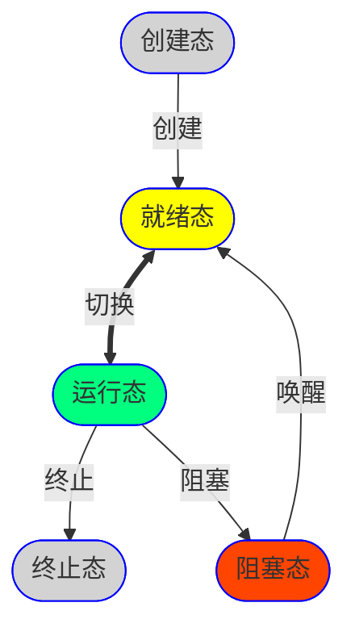
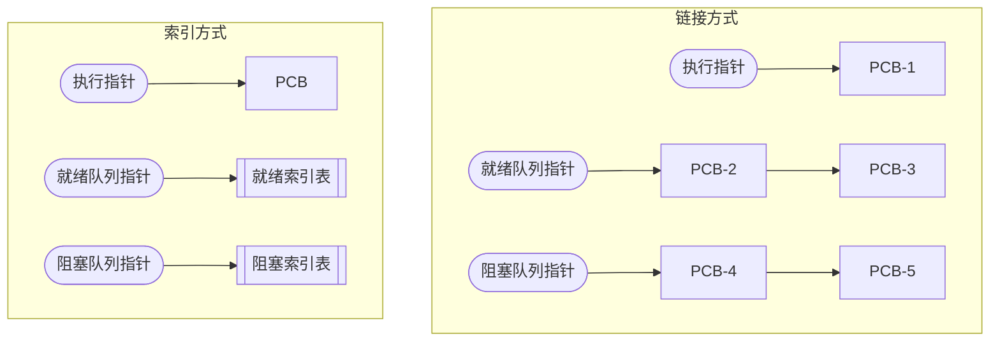

**程序**：是指令的有序集合。

**顺序执行的程序具有**：顺序性、**封闭性**、**可再现性**

**并发执行的程序具有**：间断性、无封闭性、不可再现性。

### 进程

**进程实体**：$\textnormal{\footnotesize 进程实体（进程映像）} = \{\textnormal{\footnotesize 程序段（程序代码）}, \textnormal{\footnotesize 数据段（程序运行时数据）}, PCB\}$

**PCB（Process Control Block）**：常驻内存，$PCB = \{\textnormal{\footnotesize 进程标识符}, \textnormal{\footnotesize 处理机状态信息}, \textnormal{\footnotesize 进程调度信息}, \textnormal{\footnotesize 进程控制信息}\}$

**进程**：进程实体的运行过程，是系统进行资源分配和调度的独立单位。**创建进程**就是创建进程实体中的PCB。**撤销进程**就是撤销进程实体中的PCB。

**进程的特征**：动态性（最基本特征）、并发性、独立性（资源分配、调度的独立单位）、异步性（不可预知的速度推进，可能导致结果的不确定性）、结构性。

#### 进程的状态

- 运行态：独占CPU的一个物理内核运行。
- 就绪态：已具备运行条件（运行所需资源），排队等待CPU空闲。
- 阻塞态：等待事件触发后进入就绪态。
- 创建态：OS为进程分配资源、初始化PCB。
- 终止态：OS回收进程资源，撤销PCB。

#### 进程的组织

#### 进程通信

- 共享存储系统
- 消息传递：直接通信（直接挂到接受进程的消息缓冲队列）、间接通信（先发送到信箱）。
- 管道通信：半双工通信，没有写满不能读，没有读空不能写。
- C/S系统：Socket通信。

### 线程

没有引入线程时，传统的进程是程序执行流的最小单位。引入线程后，**进程是资源分配的基本单位**；**线程是调度的基本单位**。同一进程的线程间并发不需要切换进程的运行环境，所以开销更小。

**线程特点**：轻型实体、独立调度和分配基本单位、可并发、共享进程资源。

#### 线程的实现方式

|                | 用户级线程（协程） |  内核级线程  |
| -----------------: | :----------------: | :----------: |
|             维护者 |      应用程序      | 操作系统内核 |
|         线程切换态 |       用户态       |    核心态    |
|     操作系统可见性 |       不可见       |     可见     |
|     等效实际调度数 |         否         |      是      |
|           管理开销 |         小         |     较大     |

| 用户线程与内核级线程 | 优点           | 缺点           |
| -------------------: | :------------- | :------------- |
|               多对一 | 线程管理开销小 | 并发不高       |
|               一对一 | 并发高         | 线程管理成本高 |
|               多对多 |                |                |
