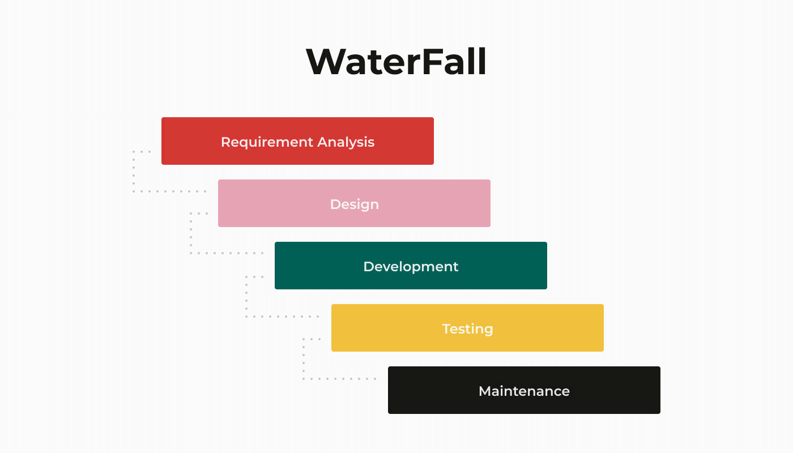
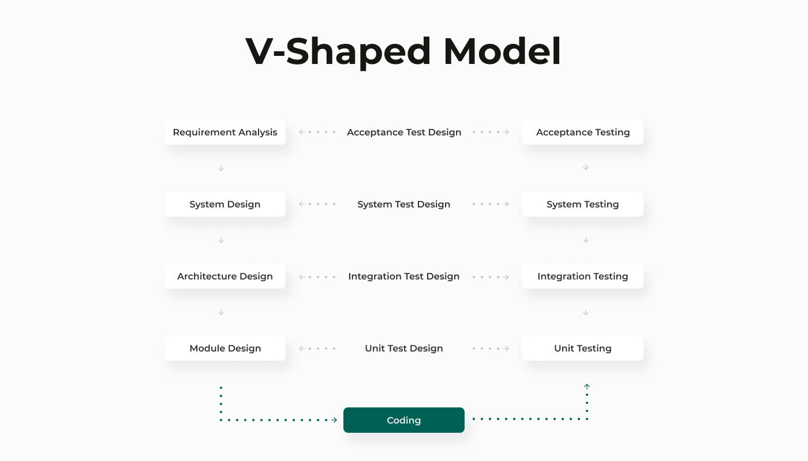
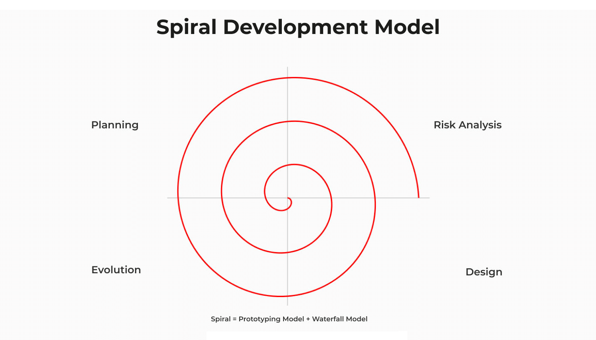
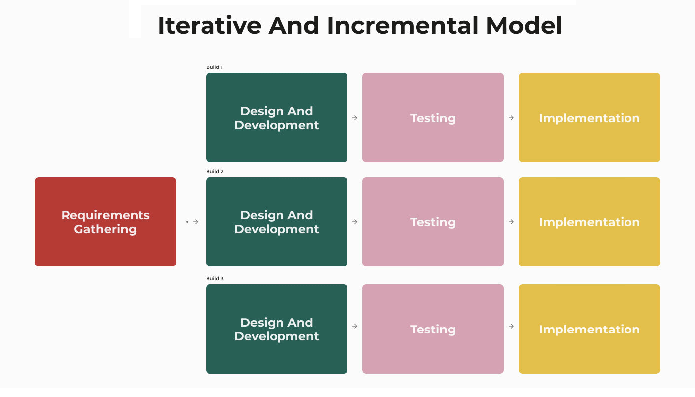
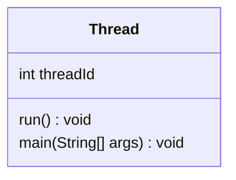
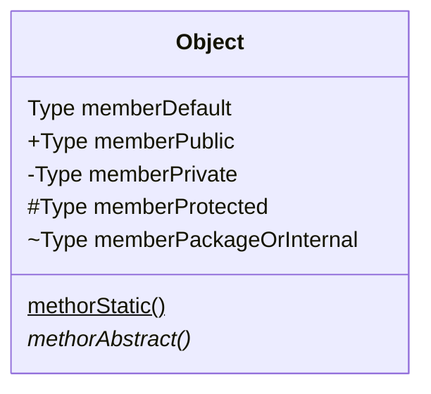
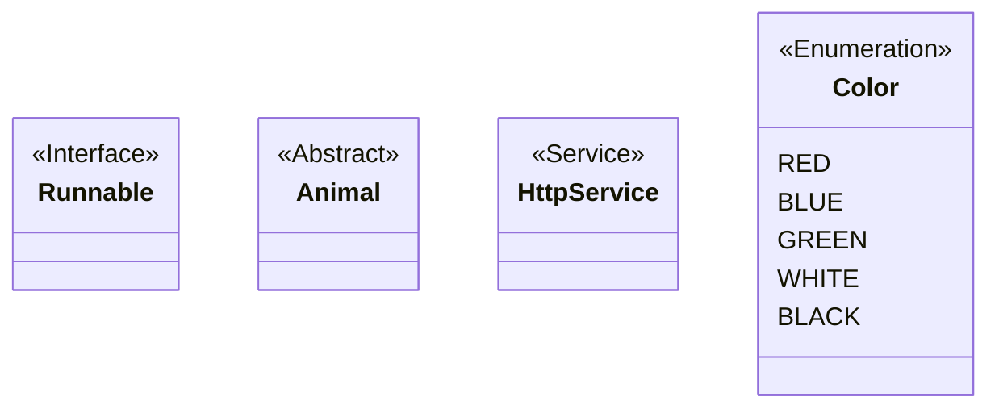
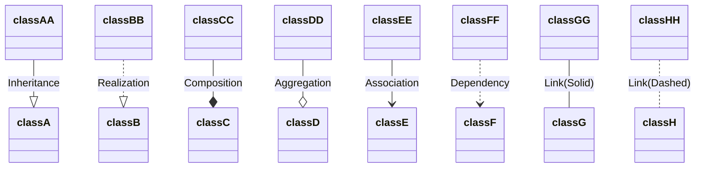
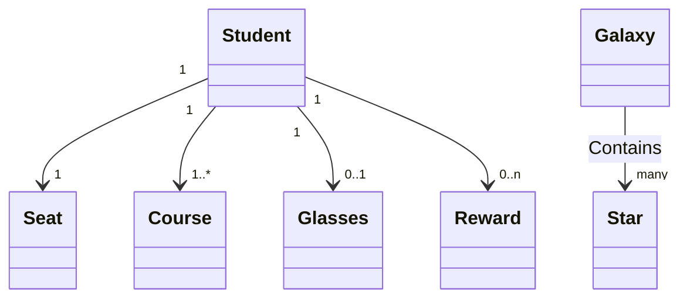
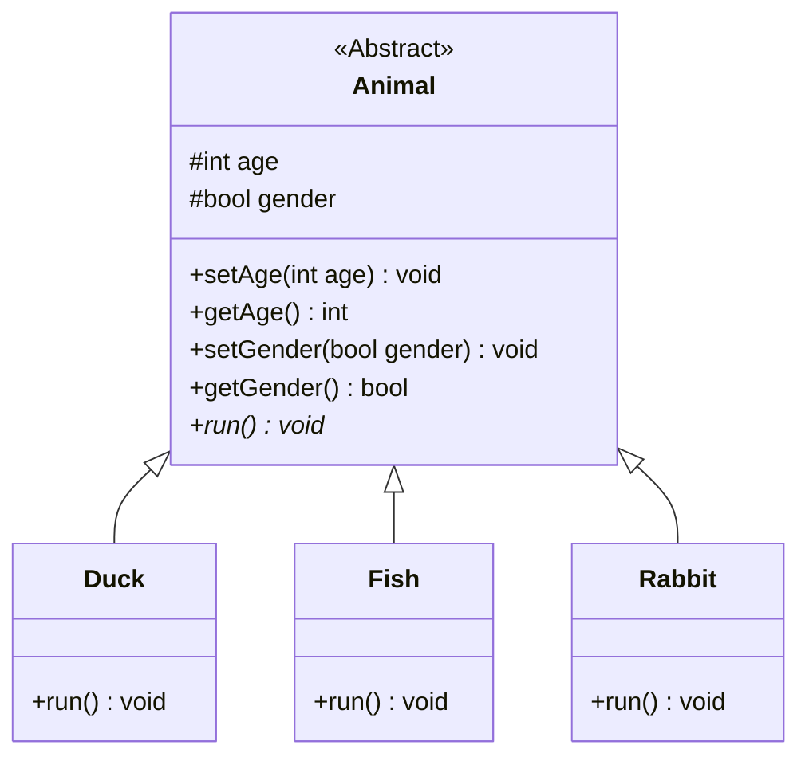

<link rel="stylesheet" href="https://zhmhbest.gitee.io/hellomathematics/style/index.css">
<script src="https://zhmhbest.gitee.io/hellomathematics/style/index.js"></script>

# [软件工程](../index.html)

[TOC]

## 概述

### 软件的定义

软件是计算机系统中与硬件相互依存的另一部分，它包括程序、数据及相关文档的完整集合。其中，程序是按事先设计的功能和性能要求执行的指令序列；数据是使程序能正常操纵信息的数据结构；文档是与程序开发、维护和使用有关的图文材料。

### 软件生存周期与软件过程

- 软件计划与可行性研究（问题定义、可行性研究）
- 需求分析
- 软件设计（概要设计和详细设计）
- 编码
- 软件测试
- 运行与维护

## 软件开发模型

|                                       模型 | 说明                                                         |
| -----------------------------------------: | :----------------------------------------------------------- |
|            瀑布模型<br>（Waterfall Model） | 开发过程是线性的，易于管理，过早的延迟会拖延整个项目，不适合需求模糊的系统 |
| 快速原型模型<br/>（Rapid Prototype Model） | “逼真”的原型可以使用户迅速作出反馈，防止舍不得抛弃           |
|                      V模型<br/>（V Model） | 早期测试介入，每个开发阶段都有一个并行测试阶段               |
|         增量模型<br/>（Incremental Model） | 把待开发的软件系统模块化，可在不知道所有需求的情况下开始开发 |
|              螺旋模型<br/>（Spiral Model） | 快速原型模型+瀑布模型，引入了风险分析，适合于大型复杂的系统  |
|            演化模型<br/>（Fountain Model） | 迭代开发方法，适用于对软件需求缺乏准确认识的情况             |
|            喷泉模型<br/>（Fountain Model） | 描述面向对象的软件开发过程                                   |









## 设计模式

### 软件设计原则（SOLID）

|                                             设计原则 | 说明                                                         |
| ---------------------------------------------------: | :----------------------------------------------------------- |
|  单一职责原则<br>（Single Responsibility Principle） | 一个类应该只有一个发生变化的原因。                           |
|               开闭原则<br/>（Open Closed Principle） | 对扩展开放，对修改关闭。                                     |
|   里氏替换原则<br/>（Liskov Substitution Principle） | 所有引用基类的地方必须能透明地使用其子类的对象。             |
|       迪米特法则/最少知道原则<br/>（Law of Demeter） | 只与你的直接朋友交谈，不跟“陌生人”说话。                     |
| 接口隔离原则<br/>（Interface Segregation Principle） | 客户端不应该依赖它不需要的接口、类间的依赖关系应该建立在最小的接口上。 |
|  依赖倒置原则<br/>（Dependence Inversion Principle） | 上层模块不应该依赖底层模块，它们都应该依赖于抽象、抽象不应该依赖于细节，细节应该依赖于抽象。 |
|       合成复用原则<br/>（Composite Reuse Principle） | 尽量使用对象组合/聚合，而不是继承关系达到软件复用的目的。    |

### 创建型模式（Creational Pattern）

|             模式 | 说明                                     |
| ---------------: | :--------------------------------------- |
|     **工厂模式** | 创建对象时不会对客户端暴露创建逻辑。     |
| **抽象工厂模式** | 围绕一个超级工厂创建其他工厂。           |
|     **单例模式** | 确保只有单个对象被创建。                 |
|   **建造者模式** | 使用多个简单的对象构建成一个复杂的对象。 |
|     **原型模式** | 创建当前对象的克隆。                     |

```java
public class Main {
    static ArrayList<String> oneObject = new ArrayList<String>() {{
        add("Default");
    }};

    static Object getFactoryInstance() {
        return new ArrayList<String>() {{
            add("Factory");
        }};
    }

    static Object getSingleInstance() {
        return oneObject;
    }

    static Object getPrototypeInstance() {
        return oneObject.clone();
    }

    public static void main(String[] args) {
        // 【工厂模式】
        Object factoryObject = getFactoryInstance();
        System.out.println(factoryObject);

        // 【抽象工厂模式】
        // 略

        // 【单列模式】
        Object singleObject = getSingleInstance();
        System.out.printf("%s %b\n", singleObject, singleObject == getSingleInstance());

        // 【建造者模式】
        StringBuilder builder = new StringBuilder();
        builder.append("Builder");
        System.out.println(builder);

        // 【原型模式】
        Object prototypeObject = getPrototypeInstance();
        System.out.printf("%s %b\n", prototypeObject, prototypeObject == getPrototypeInstance());
    }
}
```

### 结构型模式（Structural Pattern）

| 模式           | 说明                                                         |
| -------------: | :----------------------------------------------------------- |
| **适配器模式** | 为两个不兼容的接口之间的桥梁。                               |
| **装饰器模式** | 向一个现有的对象添加新的功能，同时又不改变其结构。           |
| **代理模式**   | 一个类代表另一个类的功能。                                   |
| **外观模式**   | 隐藏系统的复杂性，提供一个可以访问的接口。                   |
| **桥接模式**   | 把抽象化与实现化解耦，使得二者可以独立变化。                 |
| **组合模式**   | 把一组相似的对象当作一个单一的对象，创建了对象组的树形结构。 |
| **享元模式**   | 减少创建对象的数量，以减少内存占用和提高性能。               |

### 行为型模式（Behavioral Pattern）

|           模式 | 说明                                                         |
| -------------: | :----------------------------------------------------------- |
|   **策略模式** | 一个类的行为或其算法可以在运行时更改。                       |
|   **模板方法** | 抽象类定义，子类实现，调用抽象类运行。                       |
| **观察者模式** | 当一个对象被修改时，则会自动通知它的依赖对象。               |
| **迭代器模式** | 用于顺序访问集合对象的元素。                                 |
| **责任链模式** | 若对象不能处理该请求，则把请求传给下一个接收者。             |
|   **命令模式** | 请求以命令的形式包裹在对象中，调用对象寻找可以处理该命令的合适的对象。 |
| **备忘录模式** | 保存一个对象的某个状态，以便在适当的时候恢复对象。           |
|   **状态模式** | 类的行为是基于它的状态改变的。                               |
| **访问者模式** | 元素的执行算法可以随着访问者改变而改变。                     |
|   **中介模式** | 提供了一个中介类，用来降低多个对象和类之间的通信复杂性。     |
| **解释器模式** | 提供了评估语言的语法或表达式的方式。                         |

#### 策略模式和模板模式

| 模式 | 说明                                         | 优点                     | 缺点                                               |
| ---: | -------------------------------------------- | :----------------------- | :------------------------------------------------- |
| 策略 | 提供抽象接口，由具体实现类提供不同算法       | 横向扩展性好，灵活性高   | 客户端需要知道全部策略，若策略过多会导致复杂度升高 |
| 模板 | 对同一个算法的不同细节进行抽象提供不同的实现 | 可维护性好，纵向扩展性好 | 耦合性较高，子类无法影响父类公用模块代码           |

## UML

### Hello



### Visibility



### Annotations



### Relationship & Relations

`ObjectA "<CardinalityA>" <Arrow> "<CardinalityB>" ObjectB`

|                    关系 | `Arrow` | 说明                           |
| ----------------------: | :----: | :----------------------------- |
| **泛化（Inheritance）** | `--|>` | 面向对象语言中的继承关系       |
| **实现（Realization）** | `..|>` | 继承一个抽象类                 |
| **组合（Composition）** | `--*`  | 成员变量                       |
| **聚合（Aggregation）** | `--o`  | 是整体与部分的关系             |
| **关联（Association）** | `-->`  | 是整体与部分的关系             |
|  **依赖（Dependency）** | `..>`  | 一个类的实现需要另一个类的协助 |
|          **Solid Link** |  `--`  |                                |
|         **Dashed Link** |  `..`  |                                |



```txt
classDiagram
    classAA --|> classA : Inheritance
    classBB ..|> classB : Realization
    classCC --*  classC : Composition
    classDD --o  classD : Aggregation
    classEE -->  classE : Association
    classFF ..>  classF : Dependency
    classGG  --  classG : Link(Solid)
    classHH  ..  classH : Link(Dashed)
```

| `Cardinality` | 说明            |
| ------------: | --------------- |
|           `1` | *Only 1*        |
|           `n` | *Some*（$n>1$） |
|           `*` | *Many*          |
|        `0..1` | *Zero or One*   |
|        `0..*` | *Zero or More*  |
|        `1..*` | *One or More*   |
|        `0..n` | *Zero or Some*  |
|        `1..n` | *One or Some*   |



```txt
classDiagram
    %% 1对1
    Student "1" --> "1" Seat

    %% 1对多
    Student "1" --> "1..*" Course

    %% 1对0 或 1对1
    Student "1" --> "0..1" Glasses

    %% 1对0 或 1对一些
    Student "1" --> "0..n" Reward

    %% 银河中有很多星星
    Galaxy --> "many" Star : Contains
```

### Demonstrate



```txt
classDiagram
    class Animal {
        <<Abstract>>
        #int age
        #bool gender
        +setAge(int age) void
        +getAge() int
        +setGender(bool gender) void
        +getGender() bool
        +run()* void
    }
    class Duck {
        +run() void
    }
    class Fish {
        +run() void
    }
    class Rabbit {
        +run() void
    }
    Animal <|-- Duck
    Animal <|-- Fish
    Animal <|-- Rabbit
```
