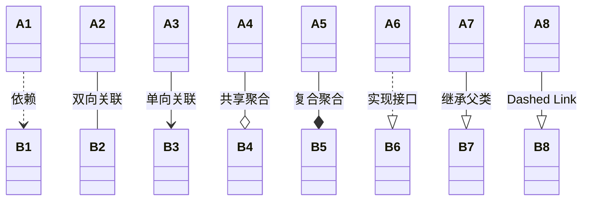
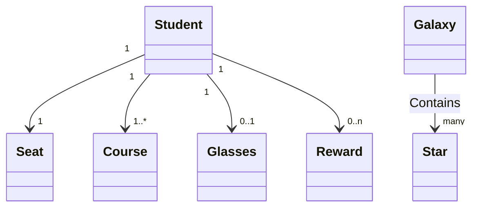
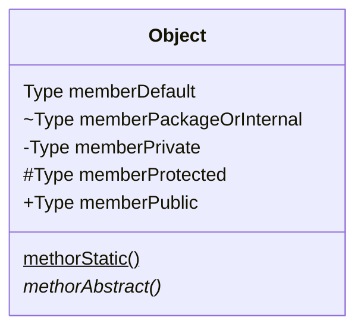
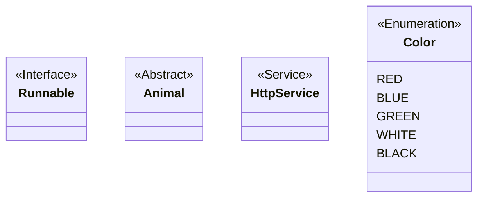
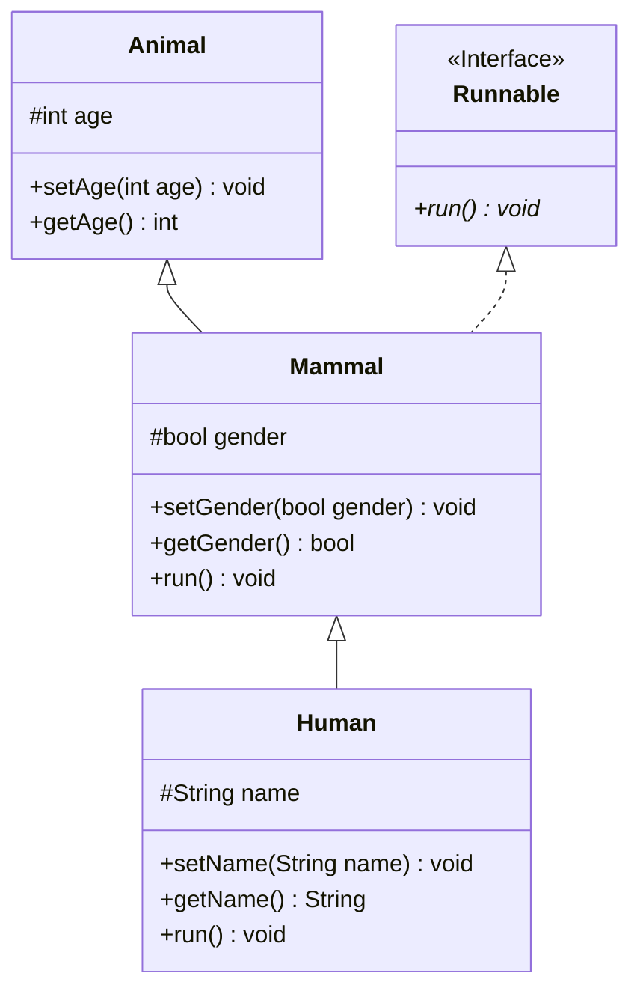

<link rel="stylesheet" href="https://zhmhbest.gitee.io/hellomathematics/style/index.css">
<script src="https://zhmhbest.gitee.io/hellomathematics/style/index.js"></script>

# [软件工程](../index.html)

[TOC]

## 软件工程概述

### 软件的特性

形态、智能、开发、质量、生产、管理、环境、维护、废弃、应用。

### 软件分类

系统软件、应用软件、支持软件、可复用软件。

### 软件生存周期

问题定义与可行性研究、需求分析、软件设计、程序编码和单元测试、集成测试和系统测试、软件运行和维护。

### 软件生存期模型

|                                       模型 | 特点                                                         | 优点                 | 缺点                                                     |
| -----------------------------------------: | :----------------------------------------------------------- | -------------------- | :------------------------------------------------------- |
|            瀑布模型<br>（Waterfall Model） | 1.阶段间具有顺序性和依赖性<br>2.推迟实现的观点<br>3.质量保证的观点 | 强迫规范化           | 1.只适用于需求已确定的情况<br>2.可能不能真正满足用户需求 |
| 快速原型模型<br/>（Rapid Prototype Model） | 快速建立可运行程序                                           | 满足用户真实需求     |                                                          |
|         增量模型<br/>（Incremental Model） | 不知道所有需求即可开始                                       | 短时间核心交付       | 须不破坏已开发的模块                                     |
|              螺旋模型<br/>（Spiral Model） | **快速原型模型**加**瀑布模型**<br/>并引入了风险分析          | 软件质量作为重要目标 | 开发人员需有丰富的风险评估经验                           |
|            喷泉模型<br/>（Fountain Model） | 面向对象的软件开发过程                                       |                      |                                                          |

## 面向对象开发

封装、继承、多态

### UML

#### UML事物

- 结构事物：类、主动类、接口、对象、用例、参与者、协作、构件、节点
- 行为事物：交互、状态机
- 分组事物：包
- 注释事物

#### UML关系

|                    关系 |        | 说明                           |
| ----------------------: | :----: | :----------------------------- |
|  **依赖（Dependency）** | `..>`  | A变化会影响B       |
| **双向关联（Association）** | `--`  | A和B的连接关系  |
| **单向关联（Association）** | `-->`  | A和B的连接关系 |
||||
| **共享聚合（Shared Aggregation）** | `--o`  | 静态成员   |
| **复合聚合（Composition Aggregation）** | `--*`  | 成员变量                       |
||||
| **实现（Implement）** | `..|>` | 实现接口               |
| **泛化（Inheritance）** | `--|>` | 继承父类    |
||||
|         **Dashed Link** |  `..`  |                                |



| `Cardinality` | 说明            |
| ------------: | --------------- |
|           `1` | *Only 1*        |
|           `n` | *Some*（$n>1$） |
|           `*` | *Many*          |
|        `0..1` | *Zero or One*   |
|        `0..*` | *Zero or More*  |
|        `1..*` | *One or More*   |
|        `0..n` | *Zero or Some*  |
|        `1..n` | *One or Some*   |



```txt
classDiagram
    %% 1对1
    Student "1" --> "1" Seat

    %% 1对多
    Student "1" --> "1..*" Course

    %% 1对0 或 1对1
    Student "1" --> "0..1" Glasses

    %% 1对0 或 1对一些
    Student "1" --> "0..n" Reward

    %% 银河中有很多星星
    Galaxy --> "many" Star : Contains
```

#### 类图

**成员可见性**：



```txt
classDiagram
    class Object {
        Type memberDefault
        ~Type memberPackageOrInternal
        -Type memberPrivate
        #Type memberProtected
        +Type memberPublic
        methorStatic()$
        methorAbstract()*
    }
```

**注解**：



```txt
classDiagram
    class Runnable {
        <<Interface>>
    }
    class Animal {
        <<Abstract>>
    }
    class HttpService {
        <<Service>>
    }
    class Color{
        <<Enumeration>>
        RED
        BLUE
        GREEN
        WHITE
        BLACK
    }
```

**示例**：



```txt
classDiagram
    class Runnable {
        <<Interface>>
        +run()* void
    }

    class Animal {
        #int age
    }
    Animal: +setAge(int age) void
    Animal: +getAge() int

    class Mammal {
        #bool gender
        +setGender(bool gender) void
        +getGender() bool
        +run() void
    }

    class Human {
        #String name
        +setName(String name) void
        +getName() String
        +run() void
    }

    Animal <|-- Mammal
    Runnable <|.. Mammal
    Mammal <|-- Human
```

### 设计模式

#### 软件设计原则（SOLID）

|                                             设计原则 | 说明                                                         |
| ---------------------------------------------------: | :----------------------------------------------------------- |
|  单一职责原则<br>（Single Responsibility Principle） | 一个类应该只有一个发生变化的原因。                           |
|               开闭原则<br/>（Open Closed Principle） | 对扩展开放，对修改关闭。                                     |
|   里氏替换原则<br/>（Liskov Substitution Principle） | 所有引用基类的地方必须能透明地使用其子类的对象。             |
|       迪米特法则/最少知道原则<br/>（Law of Demeter） | 只与你的直接朋友交谈，不跟“陌生人”说话。                     |
| 接口隔离原则<br/>（Interface Segregation Principle） | 客户端不应该依赖它不需要的接口、类间的依赖关系应该建立在最小的接口上。 |
|  依赖倒置原则<br/>（Dependence Inversion Principle） | 上层模块不应该依赖底层模块，它们都应该依赖于抽象、抽象不应该依赖于细节，细节应该依赖于抽象。 |
|       合成复用原则<br/>（Composite Reuse Principle） | 尽量使用对象组合/聚合，而不是继承关系达到软件复用的目的。    |

#### 创建型模式（Creational Pattern）

|             模式 | 说明                                     |
| ---------------: | :--------------------------------------- |
|     **工厂模式** | 创建对象时不会对客户端暴露创建逻辑。     |
| **抽象工厂模式** | 围绕一个超级工厂创建其他工厂。           |
|     **单例模式** | 确保只有单个对象被创建。                 |
|   **建造者模式** | 使用多个简单的对象构建成一个复杂的对象。 |
|     **原型模式** | 创建当前对象的克隆。                     |

```java
public class Main {
    static ArrayList<String> oneObject = new ArrayList<String>() {{
        add("Default");
    }};

    static Object getFactoryInstance() {
        return new ArrayList<String>() {{
            add("Factory");
        }};
    }

    static Object getSingleInstance() {
        return oneObject;
    }

    static Object getPrototypeInstance() {
        return oneObject.clone();
    }

    public static void main(String[] args) {
        // 【工厂模式】
        Object factoryObject = getFactoryInstance();
        System.out.println(factoryObject);

        // 【抽象工厂模式】
        // 略

        // 【单列模式】
        Object singleObject = getSingleInstance();
        System.out.printf("%s %b\n", singleObject, singleObject == getSingleInstance());

        // 【建造者模式】
        StringBuilder builder = new StringBuilder();
        builder.append("Builder");
        System.out.println(builder);

        // 【原型模式】
        Object prototypeObject = getPrototypeInstance();
        System.out.printf("%s %b\n", prototypeObject, prototypeObject == getPrototypeInstance());
    }
}
```

#### 结构型模式（Structural Pattern）

| 模式           | 说明                                                         |
| -------------: | :----------------------------------------------------------- |
| **适配器模式** | 为两个不兼容的接口之间的桥梁。                               |
| **装饰器模式** | 向一个现有的对象添加新的功能，同时又不改变其结构。           |
| **代理模式**   | 一个类代表另一个类的功能。                                   |
| **外观模式**   | 隐藏系统的复杂性，提供一个可以访问的接口。                   |
| **桥接模式**   | 把抽象化与实现化解耦，使得二者可以独立变化。                 |
| **组合模式**   | 把一组相似的对象当作一个单一的对象，创建了对象组的树形结构。 |
| **享元模式**   | 减少创建对象的数量，以减少内存占用和提高性能。               |

#### 行为型模式（Behavioral Pattern）

|           模式 | 说明                                                         |
| -------------: | :----------------------------------------------------------- |
|   **策略模式** | 一个类的行为或其算法可以在运行时更改。                       |
|   **模板方法** | 抽象类定义，子类实现，调用抽象类运行。                       |
| **观察者模式** | 当一个对象被修改时，则会自动通知它的依赖对象。               |
| **迭代器模式** | 用于顺序访问集合对象的元素。                                 |
| **责任链模式** | 若对象不能处理该请求，则把请求传给下一个接收者。             |
|   **命令模式** | 请求以命令的形式包裹在对象中，调用对象寻找可以处理该命令的合适的对象。 |
| **备忘录模式** | 保存一个对象的某个状态，以便在适当的时候恢复对象。           |
|   **状态模式** | 类的行为是基于它的状态改变的。                               |
| **访问者模式** | 元素的执行算法可以随着访问者改变而改变。                     |
|   **中介模式** | 提供了一个中介类，用来降低多个对象和类之间的通信复杂性。     |
| **解释器模式** | 提供了评估语言的语法或表达式的方式。                         |

| 模式 | 说明                                         | 优点                     | 缺点                                               |
| ---: | -------------------------------------------- | :----------------------- | :------------------------------------------------- |
| 策略 | 提供抽象接口，由具体实现类提供不同算法       | 横向扩展性好，灵活性高   | 客户端需要知道全部策略，若策略过多会导致复杂度升高 |
| 模板 | 对同一个算法的不同细节进行抽象提供不同的实现 | 可维护性好，纵向扩展性好 | 耦合性较高，子类无法影响父类公用模块代码           |
