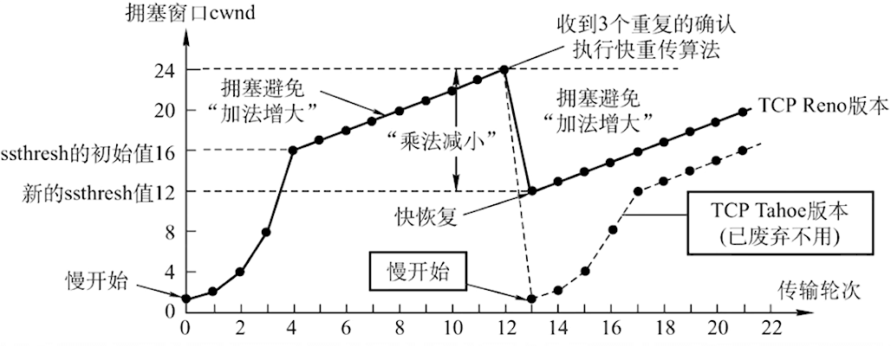

<link rel="stylesheet" href="https://zhmhbest.gitee.io/hellomathematics/style/index.css">

# [Computer Network](https://github.com/zhmhbest/HelloComputerNetwork)

[TOC]

## 概论

### 硬件设备

#### 路由器与交换机区别

| 区别 | 交换机 | 路由器 |
| - | - | - | -
| **工作层次** | 数据链路层 | 网络层 |
| **寻址依据** | MAC地址 | IP地址 |
| **转发对象** | 数据帧 | 分组报文 |
| **域分割** | 只能分割冲突域 | 可以分割广播域 |

## 物理层

## 数据链路层

### ARP

是根据IP地址获取MAC地址的一个TCP/IP协议。ARP协议工作的前提是默认了其所在的网络是一个善良的网络，每台主机在向网络中发送应答信号时都是使用的真实身份（否则会产生ARP欺诈）。

## 网络层

### IP

`pass`

### ICMP

用于在IP主机、路由器之间传递控制消息。`ping`、`tracert`等皆基于此协议。

## 传输层/运输层

### 概念

#### 协议端口（Port）

能唯一的表示确定主机下某一进程的整数（取值范围$[0,65535]$）。分为**服务端口**（取值范围$[0,49151]$）和**客户端口**（取值范围$[49152,65535]$）。

服务端口又分为**熟知端口**（取值范围$[0,1023]$）和**登记端口**（取值范围$[1024,49151]$）。

客户端口仅在客户进程运行时才动态选择。

#### 套接字（Socket）

网络中不同主机上的应用进程之间进行双向通信的端点的抽象。

$$Socket = (Host, Port)$$

### UDP

- 无连接
- 尽最大努力交付
- 面向报文
- 没有拥塞控制
- 首部开销小（8个Bytes）

#### UDP数据报

@import "tables/udp1.html"

#### UDP伪首部

@import "tables/udp2.html"

### TCP

- 面向连接
- 点对点通信
- 提供可靠交付
- 全双工通信
- 面向字节流

#### TCP首部

@import "tables/tcp.html"

#### 连接建立

- $→ SYN=1,seq=x$
- $← SYN=1,ACK=1,seq=y,ack=x+1$
- $→ ACK=1,seq=x+1,ack=y+1$

#### 连接释放

- $→ FIN=1,seq=u$
- $← ACK=1,seq=v,ack=u+1$
- $← FIN=1,ACK=1,seq=w,ack=u+1$
- $→ ACK=1,seq=u+1,ack=w+1$

#### 可靠传输

- 超时重传（超时时间根据加权平均往返时间）
- 冗余ACK重传

#### 流量控制

- 滑动窗口（动态调整窗口大小）
- 零窗口通知计时器

#### 拥塞控制

- 满开始、拥塞避免

- 快重传、快恢复

## 应用层

### DNS

### DHCP

### FTP

### SSH/TELNET

### HTTP/HTTPS

#### http和https的区别

| 区别 | http | https |
| - | - | - |
| 默认端口 | 80 | 443 |
| 有无证书 | 无 | 需要CA证书（付费） |
| 是否加密 | 无 | SSL加密 |
| 建立连接 | 交换3个包 | 交换3+9个包 |
| 资源消耗 |  | 较http多 |
| 安全性 | 无 | 安全 |

#### http1.0和http1.1的区别

| 区别 | http1.0 | http1.1 |
| - | - | - |
| 缓存处理 | `If-Modified-Since`、`Expires` | `Entity tag`、`ExIf-Unmodified-Sincepires`、`If-Match`、`If-None-Match`等更多缓存控制策略 |
| 默认连接 | 短连接 | 长连接：`Connection: keep-alive` |
| 带宽优化 | | 请求资源的部分：`206` + `Range: bytes=start-end` |
| 状态码 | | 新增24个错误状态响应码 |
| 头信息 | | 支持Host头域指明主机 |

#### 从输入URL到页面展示

1. DNS解析
2. 建立连接（构建在TCP之上的HTTP协议）
3. HTTP请求（请求行、请求头、请求体）
4. 服务端：接受请求数据、生成要返回的数据
5. HTTP响应（响应行、响应头、响应体）
6. 浏览器渲染页面

### SMTP/POP3/IMAP

### SNMP
