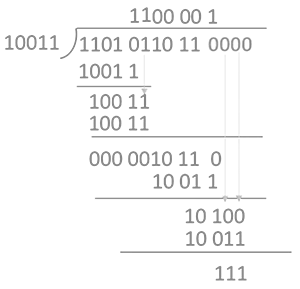

### 封装成帧

在一段数据前后分别添加首部和尾部。

$$
    \textnormal{\footnotesize 帧} =
    \textnormal{\footnotesize 帧首部} +
    \textnormal{\footnotesize 数据部分（长度≤MTU）} +
    \textnormal{\footnotesize 帧尾部}
$$

### 透明传输

- 字符计数法：第一个字节记录帧内数据部分长度。
- 字符填充法：首部填充SOH，尾部填充EOT，使用ESC作为转义符。
- 零比特填充法：
  - 开始结束填充：01111110；
  - 在发送端，遇到5个1就在后面填充一个0；
  - 在接收端，提取数据部分，只要有连续5个1就把后面的0删除；
- 违规编码：曼彻斯特编码不存在**高-高**、**低-低**两种码，可以用来做帧定界使用。

### 差错校验

#### 奇偶校验

- 奇校验：前面添加一位，使1的个数为奇数。
- 偶校验：前面添加一位，使1的个数为偶数。

#### 循环冗余检验（CRC）

待发送数据`11 0101 1011`，生成多项式`1 0011`，则冗余码（FCS）为

- 在数据末尾补$(\textnormal{\footnotesize 生成多项式长度}-1)$个0

#### 海明码

能发现双比特错误，但只能纠正单比特错误。

### 流量控制

- 停止等待协议：在收到之前发送的帧的确认信息后，再发送下一帧。
- 滑动窗口协议
  - 后退N帧协议（GBN）
  - 选择重传协议（SR）

### 传输链路

- 点对点：PPP协议
- 广播：CSMA/CD协议

### ARP协议

是根据IP地址获取MAC地址的一个TCP/IP协议。ARP协议工作的前提是默认了其所在的网络是一个善良的网络，每台主机在向网络中发送应答信号时都是使用的真实身份（否则会产生ARP欺诈）。
