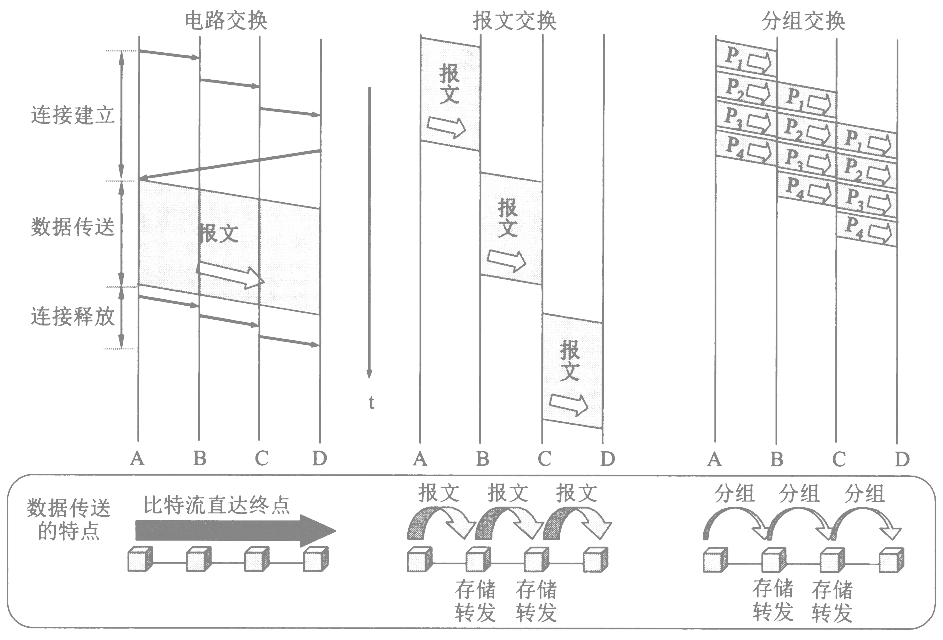

### 概念

#### 网络层功能

- 路由选择与分组转发
- 异构网络互联
- 拥塞控制

#### 数据交换方式

<!--
- 电路交换
- 报文交换
- 分组交换
-->

### 路由

#### 路由表

| 目的网络IP | 子网掩码 | 下一跳IP | 接口 |
| - | - | - | - |

#### 路由选择协议

- 外部网关协议（EGP）
  - 边界网关协议（BGP）
- 内部网关协议（IGP）
  - 开放式最短路径优先（OSPF）
    - 当**链路状态变化**时，使用洪泛法，向所有**相邻路由器**发送**与所有相邻路由器的链路状态**信息；
    - 所有自治系统内的路由器最终都能建立一个全网状态拓扑图；
  - 距离向量路由算法（RIP）
    - 维护从自身到每个目的网络的唯一最佳距离记录（跳数）；
    - 一条路由最多包含15跳，超过表示不可达；
    - 仅和相邻的路由器交换信息（每30秒）；
    - 好消息传播快，坏消息传播慢（慢收敛）；

|  | RIP | OSPF | BGP |
| - | - | - | - |
| 范围 | 内部 | 内部 | 外部 |
| 路由算法 | 距离向量 | 链路状态 | 距离向量 |
| 传递协议 | UDP | IP | TCP |
| 路径选择 | 跳数最少 | 代价最低 | 较好（非最佳） |
| 交换节点 | 相邻路由器 | 自治系统全网 | 相邻路由器 |
| 交换内容 | 路由表 | 与所有相邻路由器的链路状态 | 首次：路由表 非首次：变化部分 |

### ARP

地址解析协议（ARP），用于维护一个从IP地址到MAC地址的映射表。

ARP协议默认每台主机在向网络中发送应答信号时都使用的是真实身份（如若不然，则会产生ARP欺诈）。

### IP

`pass`

### ICMP

用于在IP主机、路由器之间传递控制消息。`ping`、`traceroute`/`tracert`等命令皆基于此协议。
